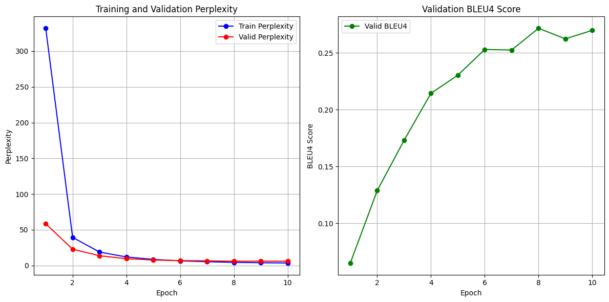
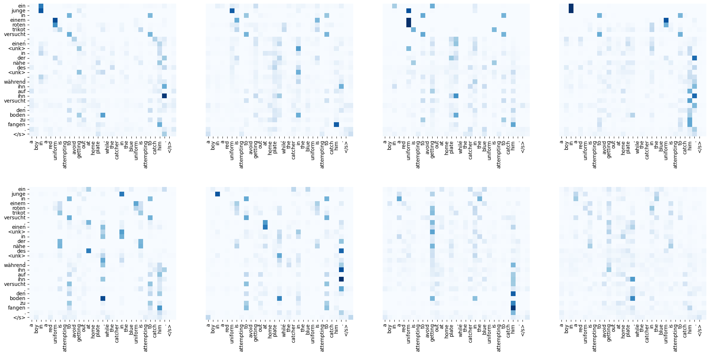
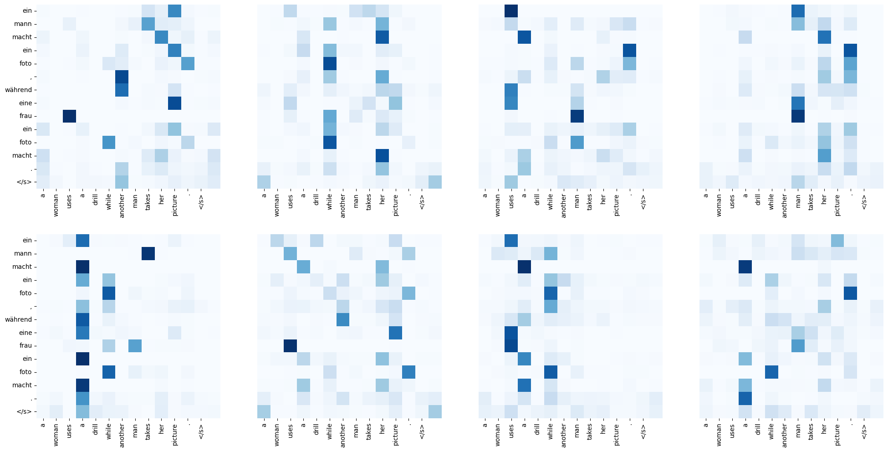
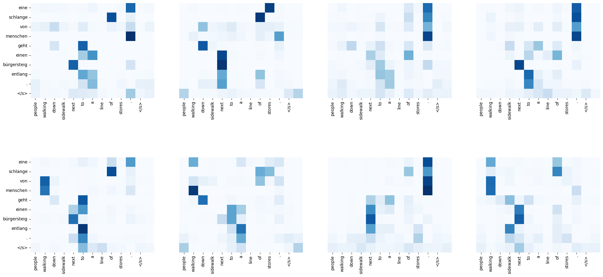

The "Attention Is All You Need" paper by Vaswani et al. presented a paradigm shift, moving away from recurrence and relying solely on attention mechanisms. This project is a step-by-step reimplementation of the tutorial notebook (https://colab.research.google.com/github/jaygala24/pytorch-implementations/blob/master/Attention%20Is%20All%20You%20Need.ipynb). The objective is to deconstruct the model into its fundamental components, implement them in PyTorch, and train a model for an English-to-German machine translation task as guided in the tutorial. This exercise aims to provide a foundational understanding of attention mechanisms and the Transformer's departure from recurrent architectures that we have been working with in my RNN repo.

## 1. Introduction: From Recurrence to Attention

Traditional sequence-to-sequence (Seq2Seq) models rely on Recurrent Neural Networks (RNNs) to process sequential data. An encoder RNN processes the input sequence into a fixed-size context vector, which is then decoded by another RNN to produce the output sequence.

A primary limitation of this architecture is the information bottleneck of the fixed-size context vector, especially for long sequences. The attention mechanism was introduced to address this by allowing the decoder to selectively focus on different parts of the input sequence at each decoding step.

The Transformer model takes this a step further by eliminating recurrence entirely, relying solely on a "self-attention" mechanism. This allows the model to weigh the importance of all other words in the input sequence for each word, enabling the capture of global dependencies and significantly improving parallelization during training.

## 2. Setup and Prerequisites

Before proceeding, the necessary libraries and language models must be installed. The following commands should be executed in the terminal. However, I found torchtext library extremely frustrating, esp since it is deprecated since Sep 2023. Hence, I have written alternate functions in data_utils.py file making the need to have torchtext redundant.


```python
from data_utils import get_multi30k_data, Vocabulary, TranslationDataset, PadCollate, bleu
from torch.utils.data import DataLoader
```


```python
#!pip install spacy torch numpy matplotlib seaborn tqdm datasets
#!python -m spacy download en_core_web_sm --quiet
#!python -m spacy download de_core_news_sm --quiet
```

### 2.1. Imports and Initial Configuration


```python
import math
import random
import numpy as np
import matplotlib.pyplot as plt
import seaborn as sns

import torch
import torch.nn as nn
import torch.optim as optim
import torch.nn.functional as F

import spacy

import warnings
from tqdm import tqdm

warnings.filterwarnings('ignore')

# For reproducibility
SEED = 42
random.seed(SEED)
np.random.seed(SEED)
torch.manual_seed(SEED)
torch.cuda.manual_seed(SEED)
torch.backends.cudnn.deterministic = True

device = torch.device('cuda' if torch.cuda.is_available() else 'cpu')
print(f"Using device: {device}")
```

    Using device: cuda


## 3. Data Preprocessing and Loading

For this machine translation task, we utilize the Multi30k dataset, which contains English, German, and French sentences. We will focus on the English-to-German pair.

The preprocessing pipeline involves:
1.  **Tokenization**: Splitting sentences into a sequence of tokens. We use `spaCy` for its robust tokenizers.
2.  **Vocabulary Building**: Creating a mapping from tokens to integer indices.
3.  **Batching**: Grouping sequences of similar length into batches using `DataLoader` and a custom collate function to handle padding.


```python
%load_ext autoreload
%autoreload 2
```


```python
PAD_TOKEN = '<pad>'
SOS_TOKEN = '<s>'
EOS_TOKEN = '</s>'
UNK_TOKEN = '<unk>'

spacy_en = spacy.load('en_core_web_sm')
spacy_de = spacy.load('de_core_news_sm')

def tokenize_en(text):
    return [tok.text.lower() for tok in spacy_en.tokenizer(text)]

def tokenize_de(text):
    return [tok.text.lower() for tok in spacy_de.tokenizer(text)]

(train_src_path, train_trg_path), \
(valid_src_path, valid_trg_path), \
(test_src_path, test_trg_path) = get_multi30k_data()

specials = ["<unk>", "<pad>", "<s>", "</s>"]
en_text = Vocabulary(tokenize_en, freq_threshold=2, specials=specials)
de_text = Vocabulary(tokenize_de, freq_threshold=2, specials=specials)

with open(train_src_path, encoding='utf-8') as f:
    src_corpus = f.readlines()
with open(train_trg_path, encoding='utf-8') as f:
    trg_corpus = f.readlines()

en_text.build_vocabulary([s.strip() for s in src_corpus])
de_text.build_vocabulary([s.strip() for s in trg_corpus])

train_data = TranslationDataset(train_src_path, train_trg_path, en_text, de_text)
valid_data = TranslationDataset(valid_src_path, valid_trg_path, en_text, de_text)
test_data = TranslationDataset(test_src_path, test_trg_path, en_text, de_text)
```

    Multi30k files already exist. Skipping download and processing.


```python
PAD_IDX = de_text.stoi[PAD_TOKEN]
SOS_IDX = de_text.stoi[SOS_TOKEN]
EOS_IDX = de_text.stoi[EOS_TOKEN]
UNK_IDX = de_text.stoi[UNK_TOKEN]

print(f'English vocabulary size: {len(en_text)} words')
print(f'German vocabulary size: {len(de_text)} words')

# Create data iterators
BATCH_SIZE = 128
pad_idx = de_text.stoi[PAD_TOKEN]
collate_fn = PadCollate(pad_idx)

train_iterator = DataLoader(train_data, batch_size=BATCH_SIZE, shuffle=True, collate_fn=collate_fn)
valid_iterator = DataLoader(valid_data, batch_size=BATCH_SIZE, shuffle=False, collate_fn=collate_fn)
test_iterator = DataLoader(test_data, batch_size=BATCH_SIZE, shuffle=False, collate_fn=collate_fn)
```

    English vocabulary size: 5893 words
    German vocabulary size: 7853 words


## 4. Model Architecture

We will now implement the core components of the Transformer model, layer by layer.

### 4.1. Scaled Dot-Product Attention

The fundamental operation in a Transformer is the attention mechanism. The model uses scaled dot-product attention, which computes a weighted sum of values based on the similarity between a query and a set of keys.

$$
\text{Attention}(Q, K, V) = \text{softmax}\left(\frac{QK^T}{\sqrt{d_k}}\right) V
$$

The scaling factor $\sqrt{d_k}$ (where $d_k$ is the dimension of the keys) is crucial for stabilizing gradients during training.


```python
class ScaledDotProductAttention(nn.Module):
    def __init__(self, scale, dropout_rate=0.1):
        super(ScaledDotProductAttention, self).__init__()
        self.scale = scale
        self.dropout = nn.Dropout(dropout_rate)

    def forward(self, query, key, value, mask=None):
        scores = torch.matmul(query, key.transpose(-2, -1))
        scores = scores / self.scale
        if mask is not None:
            scores = scores.masked_fill(mask == 0, float('-inf'))
        attn_probs = F.softmax(scores, dim=-1)
        output = torch.matmul(self.dropout(attn_probs), value)
        return output, attn_probs
```

### 4.2. Multi-Head Attention

Referring to the paper, instead of a single attention function, the Transformer employs multi-head attention. This allows the model to jointly attend to information from different representation subspaces at different positions. The input queries, keys, and values are linearly projected into $h$ different subspaces (heads). Attention is computed for each head in parallel, and the results are concatenated and projected again.

$$
\text{MultiHead}(Q, K, V) = \text{Concat}(\text{head}_1, \dots, \text{head}_h) W^O
$$
where $\text{head}_i = \text{Attention}(QW_i^Q, KW_i^K, VW_i^V)$


```python
class MultiHeadAttention(nn.Module):
    def __init__(self, d_model, n_heads, dropout_rate=0.1):
        super(MultiHeadAttention, self).__init__()
        assert d_model % n_heads == 0, "`d_model` must be divisible by `n_heads`"
        self.d_model = d_model
        self.n_heads = n_heads
        self.d_k = self.d_v = d_model // n_heads
        self.W_q = nn.Linear(d_model, d_model, bias=False)
        self.W_k = nn.Linear(d_model, d_model, bias=False)
        self.W_v = nn.Linear(d_model, d_model, bias=False)
        self.W_o = nn.Linear(d_model, d_model)
        self.attention = ScaledDotProductAttention(np.sqrt(self.d_k), dropout_rate)
    def split_heads(self, x):
        batch_size = x.size(0)
        return x.view(batch_size, -1, self.n_heads, self.d_k).transpose(1, 2)
    def group_heads(self, x):
        batch_size = x.size(0)
        return x.transpose(1, 2).contiguous().view(batch_size, -1, self.n_heads * self.d_k)
    def forward(self, query, key, value, mask=None):
        Q = self.split_heads(self.W_q(query))
        K = self.split_heads(self.W_k(key))
        V = self.split_heads(self.W_v(value))
        if mask is not None:
            mask = mask.unsqueeze(1)
        x, attn = self.attention(Q, K, V, mask)
        x = self.group_heads(x)
        x = self.W_o(x)
        return x, attn
```

### 4.3. Position-wise Feed-Forward Network

Each encoder and decoder layer contains a fully connected feed-forward network, which is applied to each position separately and identically. This consists of two linear transformations with a ReLU activation in between.

$$FFN(x) = \max(0, xW_1 + b_1)W_2 + b_2$$


```python
class PositionwiseFeedForward(nn.Module):
    def __init__(self, d_model, d_ff, dropout_rate=0.1):
        super(PositionwiseFeedForward, self).__init__()
        self.w_1 = nn.Linear(d_model, d_ff)
        self.w_2 = nn.Linear(d_ff, d_model)
        self.dropout = nn.Dropout(dropout_rate)
    def forward(self, x):
        x = self.dropout(F.relu(self.w_1(x)))
        x = self.w_2(x)
        return x
```

### 4.4. Positional Encoding

Since the model contains no recurrence or convolution, it has no inherent sense of sequence order. To provide this, we inject "positional encodings" into the input embeddings. These are sine and cosine functions of differnt frequencies:

$$ PE_{(pos, 2i)} = \sin(pos / 10000^{2i/d_{\text{model}}}) $$
$$ PE_{(pos, 2i+1)} = \cos(pos / 10000^{2i/d_{\text{model}}}) $$


```python
class PositionalEncoding(nn.Module):
    def __init__(self, d_model, dropout_rate=0.1, max_len=5000):
        super(PositionalEncoding, self).__init__()
        self.dropout = nn.Dropout(dropout_rate)
        pe = torch.zeros(max_len, d_model)
        position = torch.arange(0, max_len, dtype=torch.float).unsqueeze(1)
        div_term = torch.exp(torch.arange(0, d_model, 2).float() * (-math.log(10000.0) / d_model))
        pe[:, 0::2] = torch.sin(position * div_term)
        pe[:, 1::2] = torch.cos(position * div_term)
        pe = pe.unsqueeze(0).transpose(0, 1)
        self.register_buffer('pe', pe)
    
    def forward(self, x):
        # With batch_first=True, x is (batch_size, seq_len, d_model).
        x = x + self.pe[:x.size(1), :].squeeze(1)
        return self.dropout(x)
```

### 4.5. Encoder

The encoder is composed of a stack of N identical layers. Each layer has two sub-layers: a multi-head self-attention mechanism and a position-wise feed-forward network. Residual connections and layer normalization are applied around each sub-layer.


```python
class EncoderLayer(nn.Module):
    
    def __init__(self, d_model, n_heads, d_ff, dropout_rate=0.1):
        super(EncoderLayer, self).__init__()
        self.attn_layer = MultiHeadAttention(d_model, n_heads, dropout_rate)
        self.attn_layer_norm = nn.LayerNorm(d_model, eps=1e-6)
        self.ff_layer = PositionwiseFeedForward(d_model, d_ff, dropout_rate)
        self.ff_layer_norm = nn.LayerNorm(d_model, eps=1e-6)
        self.dropout = nn.Dropout(dropout_rate)
    
    def forward(self, x, mask):
        x1, _ = self.attn_layer(x, x, x, mask)
        x = self.attn_layer_norm(x + self.dropout(x1))
        x1 = self.ff_layer(x)
        x = self.ff_layer_norm(x + self.dropout(x1))
        return x

class Encoder(nn.Module):
    
    def __init__(self, vocab_size, d_model, n_layers, n_heads, d_ff, pad_idx, dropout_rate=0.1, max_len=5000):
        super(Encoder, self).__init__()
        self.d_model = d_model
        self.tok_embedding = nn.Embedding(vocab_size, d_model, padding_idx=pad_idx)
        self.pos_embedding = PositionalEncoding(d_model, dropout_rate, max_len)
        self.layers = nn.ModuleList([
            EncoderLayer(d_model, n_heads, d_ff, dropout_rate)
            for _ in range(n_layers)
        ])
        self.layer_norm = nn.LayerNorm(d_model, eps=1e-6)
    
    def forward(self, x, mask):
        x = self.tok_embedding(x) * math.sqrt(self.d_model)
        x = self.pos_embedding(x)
        for layer in self.layers:
            x = layer(x, mask)
        x = self.layer_norm(x)
        return x
```

### 4.6. Decoder

The decoder is also a stack of N identical layers. In addition to the two sub-layers found in the encoder, the decoder inserts a third sub-layer, which performs multi-head attention over the output of the encoder stack. The self-attention sub-layer in the decoder is also modified to prevent positions from attending to subsequent positions (causal masking).


```python
class DecoderLayer(nn.Module):
    
    def __init__(self, d_model, n_heads, d_ff, dropout_rate=0.1):
        super(DecoderLayer, self).__init__()
        self.attn_layer = MultiHeadAttention(d_model, n_heads, dropout_rate)
        self.attn_layer_norm = nn.LayerNorm(d_model, eps=1e-6)
        self.enc_attn_layer = MultiHeadAttention(d_model, n_heads, dropout_rate)
        self.enc_attn_layer_norm = nn.LayerNorm(d_model, eps=1e-6)
        self.ff_layer = PositionwiseFeedForward(d_model, d_ff, dropout_rate)
        self.ff_layer_norm = nn.LayerNorm(d_model, eps=1e-6)
        self.dropout = nn.Dropout(dropout_rate)
    
    def forward(self, x, memory, src_mask, tgt_mask):
        x1, _ = self.attn_layer(x, x, x, tgt_mask)
        x = self.attn_layer_norm(x + self.dropout(x1))
        x1, attn = self.enc_attn_layer(x, memory, memory, src_mask)
        x = self.enc_attn_layer_norm(x + self.dropout(x1)) # Corrected from attn_layer_norm
        x1 = self.ff_layer(x)
        x = self.ff_layer_norm(x + self.dropout(x1))
        return x, attn

class Decoder(nn.Module):

    def __init__(self, vocab_size, d_model, n_layers, n_heads, d_ff, pad_idx, dropout_rate=0.1, max_len=5000):
        super(Decoder, self).__init__()
        self.d_model = d_model
        self.tok_embedding = nn.Embedding(vocab_size, d_model, padding_idx=pad_idx)
        self.pos_embedding = PositionalEncoding(d_model, dropout_rate, max_len)
        self.layers = nn.ModuleList([
            DecoderLayer(d_model, n_heads, d_ff, dropout_rate)
            for _ in range(n_layers)
        ])
        self.layer_norm = nn.LayerNorm(d_model, eps=1e-6)
    
    def forward(self, x, memory, src_mask, tgt_mask):
        x = self.tok_embedding(x) * math.sqrt(self.d_model)
        x = self.pos_embedding(x)
        for layer in self.layers:
            x, attn = layer(x, memory, src_mask, tgt_mask)
        x = self.layer_norm(x)
        return x, attn
```

### 4.7. The Full Transformer

We now assemble the encoder and decoder into the full Transformer model. The model also requires a final linear layer (`Generator`) to project the decoder output to the vocabulary space, followed by a softmax to obtain token probabilities.


```python
class Transformer(nn.Module):
    
    def __init__(self, encoder, decoder, generator, pad_idx):
        super(Transformer, self).__init__()
        self.pad_idx = pad_idx
        self.encoder = encoder
        self.decoder = decoder
        self.generator = generator
    
    def get_pad_mask(self, x, pad_idx):
        return (x != pad_idx).unsqueeze(-2)
    
    def get_subsequent_mask(self, x):
        seq_len = x.size(1)
        subsequent_mask = np.triu(np.ones((1, seq_len, seq_len)), k=1).astype(np.int8)
        return (torch.from_numpy(subsequent_mask) == 0).to(x.device)
    
    def forward(self, src, tgt):
        src_mask = self.get_pad_mask(src, self.pad_idx)
        tgt_mask = self.get_pad_mask(tgt, self.pad_idx) & self.get_subsequent_mask(tgt)
        enc_output = self.encoder(src, src_mask)
        dec_output, attn = self.decoder(tgt, enc_output, src_mask, tgt_mask)
        output = self.generator(dec_output)
        return output, attn

class Generator(nn.Module):

    def __init__(self, d_model, vocab_size):
        super(Generator, self).__init__()
        self.proj = nn.Linear(d_model, vocab_size)
    
    def forward(self, x):
        x = self.proj(x)
        return F.log_softmax(x, dim=-1)
```

## 5. Training Configuration

We define the model hyperparameters, instantiate the model, and configure the optimizer and loss function.


```python
INPUT_SIZE = len(en_text)
OUTPUT_SIZE = len(de_text)
HIDDEN_SIZE = 512
N_LAYERS = 6
N_HEADS = 8
FF_SIZE = 2048
DROPOUT_RATE = 0.1
N_EPOCHS = 10
CLIP = 1.0
encoder = Encoder(INPUT_SIZE, HIDDEN_SIZE, N_LAYERS, N_HEADS, FF_SIZE, PAD_IDX, DROPOUT_RATE)
decoder = Decoder(OUTPUT_SIZE, HIDDEN_SIZE, N_LAYERS, N_HEADS, FF_SIZE, PAD_IDX, DROPOUT_RATE)
generator = Generator(HIDDEN_SIZE, OUTPUT_SIZE)
model = Transformer(encoder, decoder, generator, PAD_IDX).to(device)
def model_summary(model):
    print(f'# of trainable params: {sum(p.numel() for p in model.parameters() if p.requires_grad):,}')
    print(f'# of non-trainable params: {sum(p.numel() for p in model.parameters() if not p.requires_grad):,}')
model_summary(model)
```

    # of trainable params: 55,179,437
    # of non-trainable params: 0


### 5.1. Optimizer

The paper specifies using the Adam optimizer with a custom learning rate schedule. The learning rate increases linearly for a set number of "warm-up" steps and then decreases proportionally to the inverse square root of the step number. This strategy, implemented in the `NoamOptim` class in the tutorial, helps to prevent instability in the early stages of training.


```python

class NoamOptim(object):
    def __init__(self, optimizer, d_model, factor, n_warmup_steps):
        self.optimizer = optimizer
        self.d_model = d_model
        self.factor = factor
        self.n_warmup_steps = n_warmup_steps
        self.n_steps = 0
    def zero_grad(self):
        self.optimizer.zero_grad()
    def step(self):
        self.n_steps += 1
        lr = self.get_lr()
        for p in self.optimizer.param_groups:
            p['lr'] = lr
        self.optimizer.step()
    def get_lr(self):
        return self.factor * (
                self.d_model ** (-0.5)
                * min(self.n_steps ** (-0.5), self.n_steps * self.n_warmup_steps ** (-1.5))
        )
optimizer = NoamOptim(
    optim.Adam(model.parameters(), lr=1e-4, betas=(0.9, 0.98), eps=1e-9),
    model.encoder.d_model, 2, 4000
)
criterion = nn.CrossEntropyLoss(ignore_index=PAD_IDX)
```

## 6. Training and Evaluation

We define the training and evaluation functions. The training function iterates through the data, performs forward and backward passes, and updates the model parameters. The evaluation function computes the loss and BLEU score on the validation set without updating the model.


```python
def convert_ids_to_text(ids, vocab, eos_idx, unk_idx):
    if ids.dim() == 1:
        output_tokens = []
        for token_id_tensor in ids:
            token_id = token_id_tensor.item()
            if token_id == eos_idx:
                break
            else:
                output_tokens.append(vocab.itos[token_id])
        return output_tokens
    elif ids.dim() == 2:
        return [convert_ids_to_text(ids[i, :], vocab, eos_idx, unk_idx) for i in range(ids.size(0))]
    raise RuntimeError(f'ids has {ids.size()} dimensions, expected 2 dimensions')

def train_fn(model, iterator, optimizer, criterion, clip=1.0):
    model.train()
    total_loss = 0
    steps = 0
    tk0 = tqdm(iterator, total=len(iterator), position=0, leave=True)

    for idx, batch in enumerate(tk0):
        source, _ = batch.src
        target, _ = batch.trg
        source, target = source.to(device), target.to(device)

        optimizer.zero_grad()
        output, _ = model(source, target[:, :-1])

        loss = criterion(
            output.view(-1, output.size(-1)),
            target[:, 1:].contiguous().view(-1)
        )
        total_loss += loss.item()
        steps += 1

        loss.backward()
        nn.utils.clip_grad_norm_(model.parameters(), clip)
        optimizer.step()

        tk0.set_postfix(loss=total_loss / steps)

    tk0.close()
    return np.exp(total_loss / len(iterator))

def eval_fn(model, iterator, criterion):
    model.eval()
    total_loss = 0.0
    steps = 0
    hypotheses = []
    references = []
    tk0 = tqdm(iterator, total=len(iterator), position=0, leave=True)

    with torch.no_grad():
        for idx, batch in enumerate(tk0):
            source, _ = batch.src
            target, _ = batch.trg
            source, target = source.to(device), target.to(device)

            output, _ = model(source, target[:, :-1])

            loss = criterion(
                output.view(-1, output.size(-1)),
                target[:, 1:].contiguous().view(-1)
            )
            total_loss += loss.item()
            steps += 1

            output_ids = output.argmax(dim=-1)
            target_ids = target[:, 1:]

            pred_tokens = convert_ids_to_text(output_ids, de_text, EOS_IDX, UNK_IDX)
            target_tokens = convert_ids_to_text(target_ids, de_text, EOS_IDX, UNK_IDX)

            hypotheses.extend(pred_tokens)
            references.extend([[token] for token in target_tokens])

            tk0.set_postfix(loss=total_loss / steps)

    tk0.close()
    perplexity = np.exp(total_loss / len(iterator))
    bleu4 = bleu(hypotheses, references)
    return perplexity, bleu4
```


```python
best_bleu4 = float('-inf')
es_patience = 3
patience = 0
model_path = 'model.pth'

train_perplexities = []
valid_perplexities = []
valid_bleu4_scores = []

for epoch in range(N_EPOCHS):
    print(f'Epoch: {epoch+1}/{N_EPOCHS}')
    train_perplexity = train_fn(model, train_iterator, optimizer, criterion, CLIP)
    valid_perplexity, valid_bleu4 = eval_fn(model, valid_iterator, criterion)

    train_perplexities.append(train_perplexity)
    valid_perplexities.append(valid_perplexity)
    valid_bleu4_scores.append(valid_bleu4)

    print(f'Train perplexity: {train_perplexity:.4f}, Valid perplexity: {valid_perplexity:.4f}, Valid BLEU4: {valid_bleu4:.4f}')
    is_best = valid_bleu4 > best_bleu4
    if is_best:
        print(f'BLEU score improved ({best_bleu4:.4f} -> {valid_bleu4:.4f}). Saving Model!')
        best_bleu4 = valid_bleu4
        patience = 0
        torch.save(model.state_dict(), model_path)
    else:
        patience += 1
        print(f'Early stopping counter: {patience} out of {es_patience}')
        if patience == es_patience:
            print(f'Early stopping! Best BLEU4: {best_bleu4:.4f}')
            break
```

    Epoch: 1/10


    100%|███████████████████████████████████████████████████████████████████████████████████████████████████████████████████████████████████████████████████████████████████████████████████████████████████████████████████████████████| 227/227 [00:33<00:00,  6.73it/s, loss=5.81]
    100%|███████████████████████████████████████████████████████████████████████████████████████████████████████████████████████████████████████████████████████████████████████████████████████████████████████████████████████████████████| 8/8 [00:00<00:00,  8.54it/s, loss=4.07]


    Train perplexity: 332.0006, Valid perplexity: 58.3953, Valid BLEU4: 0.0649
    BLEU score improved (-inf -> 0.0649). Saving Model!
    Epoch: 2/10


    100%|███████████████████████████████████████████████████████████████████████████████████████████████████████████████████████████████████████████████████████████████████████████████████████████████████████████████████████████████| 227/227 [00:33<00:00,  6.82it/s, loss=3.67]
    100%|███████████████████████████████████████████████████████████████████████████████████████████████████████████████████████████████████████████████████████████████████████████████████████████████████████████████████████████████████| 8/8 [00:00<00:00,  9.06it/s, loss=3.13]


    Train perplexity: 39.3447, Valid perplexity: 22.8208, Valid BLEU4: 0.1287
    BLEU score improved (0.0649 -> 0.1287). Saving Model!
    Epoch: 3/10


    100%|███████████████████████████████████████████████████████████████████████████████████████████████████████████████████████████████████████████████████████████████████████████████████████████████████████████████████████████████| 227/227 [00:33<00:00,  6.68it/s, loss=2.94]
    100%|███████████████████████████████████████████████████████████████████████████████████████████████████████████████████████████████████████████████████████████████████████████████████████████████████████████████████████████████████| 8/8 [00:01<00:00,  7.69it/s, loss=2.61]


    Train perplexity: 18.8367, Valid perplexity: 13.6523, Valid BLEU4: 0.1730
    BLEU score improved (0.1287 -> 0.1730). Saving Model!
    Epoch: 4/10


    100%|███████████████████████████████████████████████████████████████████████████████████████████████████████████████████████████████████████████████████████████████████████████████████████████████████████████████████████████████| 227/227 [00:33<00:00,  6.84it/s, loss=2.48]
    100%|███████████████████████████████████████████████████████████████████████████████████████████████████████████████████████████████████████████████████████████████████████████████████████████████████████████████████████████████████| 8/8 [00:01<00:00,  7.77it/s, loss=2.25]


    Train perplexity: 11.9078, Valid perplexity: 9.4412, Valid BLEU4: 0.2144
    BLEU score improved (0.1730 -> 0.2144). Saving Model!
    Epoch: 5/10


    100%|███████████████████████████████████████████████████████████████████████████████████████████████████████████████████████████████████████████████████████████████████████████████████████████████████████████████████████████████| 227/227 [00:34<00:00,  6.59it/s, loss=2.14]
    100%|███████████████████████████████████████████████████████████████████████████████████████████████████████████████████████████████████████████████████████████████████████████████████████████████████████████████████████████████████| 8/8 [00:00<00:00,  8.37it/s, loss=2.04]


    Train perplexity: 8.5161, Valid perplexity: 7.6943, Valid BLEU4: 0.2304
    BLEU score improved (0.2144 -> 0.2304). Saving Model!
    Epoch: 6/10


    100%|███████████████████████████████████████████████████████████████████████████████████████████████████████████████████████████████████████████████████████████████████████████████████████████████████████████████████████████████| 227/227 [00:32<00:00,  6.94it/s, loss=1.87]
    100%|███████████████████████████████████████████████████████████████████████████████████████████████████████████████████████████████████████████████████████████████████████████████████████████████████████████████████████████████████| 8/8 [00:00<00:00,  9.80it/s, loss=1.92]


    Train perplexity: 6.5046, Valid perplexity: 6.7985, Valid BLEU4: 0.2530
    BLEU score improved (0.2304 -> 0.2530). Saving Model!
    Epoch: 7/10


    100%|███████████████████████████████████████████████████████████████████████████████████████████████████████████████████████████████████████████████████████████████████████████████████████████████████████████████████████████████| 227/227 [00:33<00:00,  6.75it/s, loss=1.66]
    100%|███████████████████████████████████████████████████████████████████████████████████████████████████████████████████████████████████████████████████████████████████████████████████████████████████████████████████████████████████| 8/8 [00:00<00:00, 10.56it/s, loss=1.87]


    Train perplexity: 5.2667, Valid perplexity: 6.4611, Valid BLEU4: 0.2525
    Early stopping counter: 1 out of 3
    Epoch: 8/10


    100%|███████████████████████████████████████████████████████████████████████████████████████████████████████████████████████████████████████████████████████████████████████████████████████████████████████████████████████████████| 227/227 [00:33<00:00,  6.77it/s, loss=1.48]
    100%|███████████████████████████████████████████████████████████████████████████████████████████████████████████████████████████████████████████████████████████████████████████████████████████████████████████████████████████████████| 8/8 [00:00<00:00, 10.47it/s, loss=1.77]


    Train perplexity: 4.4055, Valid perplexity: 5.8975, Valid BLEU4: 0.2716
    BLEU score improved (0.2530 -> 0.2716). Saving Model!
    Epoch: 9/10


    100%|███████████████████████████████████████████████████████████████████████████████████████████████████████████████████████████████████████████████████████████████████████████████████████████████████████████████████████████████| 227/227 [00:34<00:00,  6.62it/s, loss=1.34]
    100%|███████████████████████████████████████████████████████████████████████████████████████████████████████████████████████████████████████████████████████████████████████████████████████████████████████████████████████████████████| 8/8 [00:00<00:00,  9.90it/s, loss=1.81]


    Train perplexity: 3.8371, Valid perplexity: 6.0982, Valid BLEU4: 0.2623
    Early stopping counter: 1 out of 3
    Epoch: 10/10


    100%|███████████████████████████████████████████████████████████████████████████████████████████████████████████████████████████████████████████████████████████████████████████████████████████████████████████████████████████████| 227/227 [00:33<00:00,  6.84it/s, loss=1.25]
    100%|███████████████████████████████████████████████████████████████████████████████████████████████████████████████████████████████████████████████████████████████████████████████████████████████████████████████████████████████████| 8/8 [00:00<00:00,  8.30it/s, loss=1.77]


    Train perplexity: 3.4840, Valid perplexity: 5.8967, Valid BLEU4: 0.2698
    Early stopping counter: 2 out of 3


### 6.1. Final Evaluation on Test Set


```python
def plot_metrics(train_perplexities, valid_perplexities, valid_bleu4_scores):
    """Plots training and validation metrics over epochs."""
    epochs = range(1, len(train_perplexities) + 1)
    plt.figure(figsize=(12, 6))
    
    plt.subplot(1, 2, 1)
    plt.plot(epochs, train_perplexities, 'b-o', label='Train Perplexity')
    plt.plot(epochs, valid_perplexities, 'r-o', label='Valid Perplexity')
    plt.xlabel('Epoch')
    plt.ylabel('Perplexity')
    plt.title('Training and Validation Perplexity')
    plt.legend()
    plt.grid(True)

    plt.subplot(1, 2, 2)
    plt.plot(epochs, valid_bleu4_scores, 'g-o', label='Valid BLEU4')
    plt.xlabel('Epoch')
    plt.ylabel('BLEU4 Score')
    plt.title('Validation BLEU4 Score')
    plt.legend()
    plt.grid(True)

    plt.tight_layout()
    plt.show()
```


```python
model.load_state_dict(torch.load(model_path, map_location=device))
print('\nEvaluating the model on test data ...')
test_perplexity, test_bleu4 = eval_fn(model, test_iterator, criterion)
print(f'Test perplexity: {test_perplexity:.4f}, Test BLEU4: {test_bleu4:.4f}')
plot_metrics(train_perplexities=train_perplexities,
        valid_perplexities=valid_perplexities,
        valid_bleu4_scores=valid_bleu4_scores)
```

    
    Evaluating the model on test data ...


    100%|███████████████████████████████████████████████████████████████████████████████████████████████████████████████████████████████████████████████████████████████████████████████████████████████████████████████████████████████████| 8/8 [00:01<00:00,  7.93it/s, loss=1.77]


    Test perplexity: 5.8798, Test BLEU4: 0.2792


    

    


## 7. Inference and Attention Visualization

To qualitatively assess the model, we perform inference on a few examples. We use a simple greedy decoding strategy. Crucially, we also visualize the attention weights from the final decoder layer to understand which parts of the source sentence the model focuses on when generating each target token.


```python
def greedy_decode(model, sentence, max_len=100):
    model.eval()

    if isinstance(sentence, str):
        tokens = tokenize_en(sentence)
    else:
        tokens = [token.lower() for token in sentence]
    token_ids = [SOS_IDX] + en_text.numericalize(" ".join(tokens)) + [EOS_IDX]
    source = torch.tensor(token_ids, dtype=torch.long).unsqueeze(0).to(device)
    source_mask = model.get_pad_mask(source, PAD_IDX)
    with torch.no_grad():
        enc_output = model.encoder(source, source_mask)
    target_ids = [SOS_IDX]
    for i in range(max_len):
        target = torch.tensor(target_ids, dtype=torch.long).unsqueeze(0).to(device)
        target_mask = model.get_pad_mask(target, PAD_IDX) & model.get_subsequent_mask(target)
        with torch.no_grad():
            dec_output, attn = model.decoder(target, enc_output, source_mask, target_mask)
            output = model.generator(dec_output)
        target_id = output.argmax(dim=-1)[:, -1].item()
        target_ids.append(target_id)
        if target_id == EOS_IDX or len(target_ids) >= max_len:
            break
    target_tokens = [de_text.itos[id] for id in target_ids]
    attn = attn.squeeze(0).cpu().detach().numpy()
    return target_tokens[1:], attn
    
def plot_attention_scores(source, target, attention):
    n_heads = attention.shape[0]
    if isinstance(source, str):
        source = [token.lower() for token in source.split(" ")] + [EOS_TOKEN]
    else:
        source = [token.lower() for token in source] + [EOS_TOKEN]
    fig = plt.figure(figsize=(24, 12))
    for h, head in enumerate(attention):
        ax = fig.add_subplot(2, 4, h + 1)
        x = source
        y = target if h % 4 == 0 else []
        sns.heatmap(
            head, xticklabels=x, yticklabels=y, square=True,
            vmin=0.0, vmax=1.0, cbar=False, cmap="Blues", ax=ax,
        )
    plt.show()
```


```python
print("\n--- Inference Examples ---")
example_indices = [7, 24, 50]
for example_idx in example_indices:
    source_sentence = test_data.src_sentences[example_idx].strip()
    target_sentence = test_data.trg_sentences[example_idx].strip()

    predicted_tokens, attention_scores = greedy_decode(model, source_sentence)

    print(f'\nSource: {source_sentence}')
    print(f'Target: {target_sentence}')
    print(f'Predicted: {" ".join(predicted_tokens).replace(" </s>", "")}')

    source_tokens = tokenize_en(source_sentence)
    plot_attention_scores(source_tokens, predicted_tokens, attention_scores)
```

    
    --- Inference Examples ---
    
    Source: A boy in a red uniform is attempting to avoid getting out at home plate, while the catcher in the blue uniform is attempting to catch him.
    Target: Ein Junge in einem roten Trikot versucht, die Home Base zu erreichen, während der Catcher im blauen Trikot versucht, ihn zu fangen.
    Predicted: ein junge in einem roten trikot versucht , einen <unk> in der nähe des <unk> , während ihn auf ihn versucht , den boden zu fangen .


    

    


    
    Source: A woman uses a drill while another man takes her picture.
    Target: Eine Frau verwendet eine Bohrmaschine während ein Mann sie fotografiert.
    Predicted: ein mann macht ein foto , während eine frau ein foto macht .


    

    


    
    Source: People walking down sidewalk next to a line of stores.
    Target: Leute gehen auf einem Gehsteig neben einer Reihe von Geschäften.
    Predicted: eine schlange von menschen geht einen bürgersteig entlang .


    

    


## 8. Conclusion

In this notebook, we implementated of the Transformer model from scratch! By building each component—from scaled dot-product attention to the full encoder-decoder stack we gained a practical understanding of how self-attention replaces recurrence for sequence transduction tasks. The results on the Multi30k dataset demonstrate the model's capability, and the attention visualizations provide qualitative insight into its inner workings and serves as a strong baseline for further research into attention-based architectures..