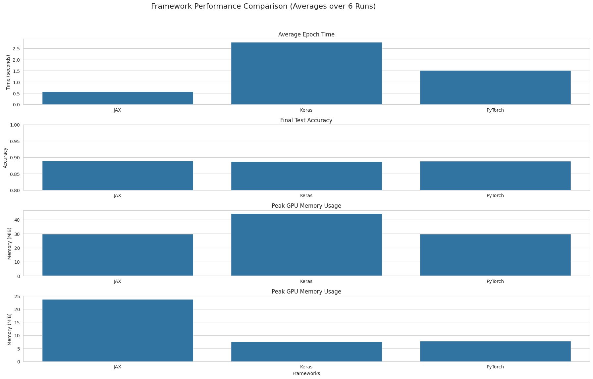
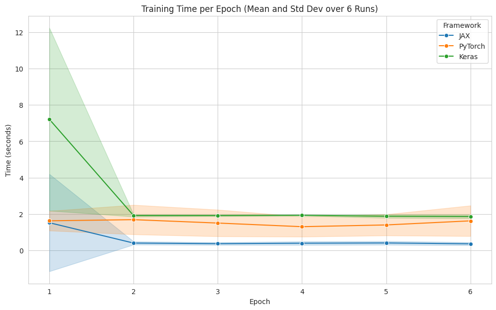

# JAX vs. PyTorch vs. Keras (Benchmarking MNIST)

I recently implemented a simple MNIST classifier in JAX (mnist.py), and I've become intrigued by its functional approach and the promise of its Just-In-Time (JIT) compiler, `jit`. To understand its place in the ml ecosystem, a showdown with the established giants, PyTorch and Keras (TensorFlow), is in order..

This notebook documents the benchmarking experiment. We will implement one simple Multi-Layer Perceptron (MLP) architecture for MNIST classification in all three frameworks. Our goal is to compare them not just on final accuracy, but on key performance metrics that matter in a research and development context:

1.  **Training Time**: How quickly can each framework chew through epochs?
2.  **Accuracy**: Do the frameworks converge to a similar performance level?
3.  **GPU Memory Usage**: What is the memory footprint of each framework for the same task?

We will run multiple independent trials to gather statistics and visualize the results to draw meaningful conclusions about the trade-offs and benefits of each framework.

## Setup

First, we'll import all necessary libraries. We need `jax`, `torch`, and `tensorflow` for the core implementations. For data handling and plotting, we'll use `numpy`, `matplotlib`, and `pandas`. We'll also import `pynvml` to monitor GPU memory usage. We'll set a random seed for reproducibility across our runs. The **biggest challenge** was to have a compatible version of cuda that worked with all 3 frameworks. I have written utility scripts that tests the existence and compatibility of each libraries


```python
import time
import numpy as np
import pandas as pd
import matplotlib.pyplot as plt
import seaborn as sns

# JAX Imports
import jax
import jax.numpy as jnp
from jax import jit, grad, random
from jax.scipy.special import logsumexp

# PyTorch Imports
import torch
import torch.nn as nn
from torch.utils.data import TensorDataset, DataLoader

# Keras (TensorFlow) Imports
import tensorflow as tf
from tensorflow import keras
from tensorflow.keras import layers

# GPU Monitoring
try:
    import pynvml
    pynvml.nvmlInit()
    GPU_AVAILABLE = True
except (ImportError, pynvml.NVMLError):
    GPU_AVAILABLE = False
    print("pynvml not found or GPU not available. GPU memory usage will not be monitored.")

# For reproducibility
SEED = 42
np.random.seed(SEED)
tf.random.set_seed(SEED)
torch.manual_seed(SEED)
key = random.PRNGKey(SEED)

device = torch.device('cuda' if torch.cuda.is_available() else 'cpu')
print(f"PyTorch is using device: {device}")
```

    2025-08-12 08:12:04.397522: E external/local_xla/xla/stream_executor/cuda/cuda_fft.cc:467] Unable to register cuFFT factory: Attempting to register factory for plugin cuFFT when one has already been registered
    WARNING: All log messages before absl::InitializeLog() is called are written to STDERR
    E0000 00:00:1755004324.414011   80258 cuda_dnn.cc:8579] Unable to register cuDNN factory: Attempting to register factory for plugin cuDNN when one has already been registered
    E0000 00:00:1755004324.418535   80258 cuda_blas.cc:1407] Unable to register cuBLAS factory: Attempting to register factory for plugin cuBLAS when one has already been registered
    W0000 00:00:1755004324.429354   80258 computation_placer.cc:177] computation placer already registered. Please check linkage and avoid linking the same target more than once.
    W0000 00:00:1755004324.429373   80258 computation_placer.cc:177] computation placer already registered. Please check linkage and avoid linking the same target more than once.
    W0000 00:00:1755004324.429375   80258 computation_placer.cc:177] computation placer already registered. Please check linkage and avoid linking the same target more than once.
    W0000 00:00:1755004324.429375   80258 computation_placer.cc:177] computation placer already registered. Please check linkage and avoid linking the same target more than once.


    PyTorch is using device: cuda


## Model Configuration and Data Loader

To ensure a fair comparison, all three models will use the exact same architecture, hyperparameters, and data. We'll define these constants upfront.

**Architecture**: A simple MLP with two hidden layers of 1024 neurons each, using `tanh` activation functions.
**Dataset**: MNIST, with pixel values normalized to `[0, 1]` and labels one-hot encoded.

We'll load the data once using Keras's convenient dataset loader and then adapt it for each framework.


```python
# --- Benchmark Configuration ---
LAYER_SIZES = [784, 1024, 1024, 10]
PARAM_SCALE = 0.1
STEP_SIZE = 0.001
NUM_EPOCHS = 6
BATCH_SIZE = 128
NUM_RUNS = 6 # Number of independent runs for benchmarking

# --- Data Loading and Preprocessing ---
def get_mnist_data():
    (x_train, y_train), (x_test, y_test) = keras.datasets.mnist.load_data()
    
    # Flatten and normalize images
    x_train = np.reshape(x_train, (len(x_train), -1)) / 255.0
    x_test = np.reshape(x_test, (len(x_test), -1)) / 255.0
    
    # One-hot encode labels
    y_train = keras.utils.to_categorical(y_train, 10)
    y_test = keras.utils.to_categorical(y_test, 10)
    
    return x_train, y_train, x_test, y_test

x_train, y_train, x_test, y_test = get_mnist_data()
print(f"Training data shape: {x_train.shape}")
print(f"Test data shape: {x_test.shape}")
```

    Training data shape: (60000, 784)
    Test data shape: (10000, 784)


### GPU Monitoring Helper

This utility function will help us measure the peak GPU memory usage during each training run:


```python
def get_gpu_memory_usage():
    if not GPU_AVAILABLE:
        return 0
    handle = pynvml.nvmlDeviceGetHandleByIndex(0)
    info = pynvml.nvmlDeviceGetMemoryInfo(handle)
    return info.used // 1024**2 # Return in MiB
```

## Framework 1: JAX

We'll start with JAX, adapting the provided script. The key characteristics of this implementation are:
- **Functional:** The model parameters, prediction logic, and update steps are all handled as pure **functions**.
- **Explicit State:** The model's parameters (`params`) are explicitly passed into every function, never stored as an object's internal state.
- **JIT Compilation:** We use `@jit` to compile the `update` function. This is where JAX's performance benefits should shine, as it traces the function once and then executes the highly optimized, compiled version for subsequent calls.


```python
def init_random_params(scale, layer_sizes, rng_key):
    keys = random.split(rng_key, len(layer_sizes))
    return [(scale * random.normal(k, (m, n)), scale * random.normal(k, (n,)))
            for m, n, k in zip(layer_sizes[:-1], layer_sizes[1:], keys)]

def predict_jax(params, inputs):
    activations = inputs
    for w, b in params[:-1]:
        outputs = jnp.dot(activations, w) + b
        activations = jnp.tanh(outputs)
    final_w, final_b = params[-1]
    logits = jnp.dot(activations, final_w) + final_b
    return logits - logsumexp(logits, axis=1, keepdims=True)

def loss_jax(params, batch):
    inputs, targets = batch
    preds = predict_jax(params, inputs)
    return -jnp.mean(jnp.sum(preds * targets, axis=1))

def accuracy_jax(params, batch):
    inputs, targets = batch
    target_class = jnp.argmax(targets, axis=1)
    predicted_class = jnp.argmax(predict_jax(params, inputs), axis=1)
    return jnp.mean(predicted_class == target_class)

@jit
def update_jax(params, batch):
    grads = grad(loss_jax)(params, batch)
    return [(w - STEP_SIZE * dw, b - STEP_SIZE * db)
            for (w, b), (dw, db) in zip(params, grads)]

def benchmark_jax(rng_key):
    params = init_random_params(PARAM_SCALE, LAYER_SIZES, rng_key)
    epoch_times = []
    mem_before = get_gpu_memory_usage()
    epoch_mems = []
    
    num_train = len(x_train)
    num_batches = int(np.ceil(num_train / BATCH_SIZE))
    
    for epoch in range(NUM_EPOCHS):
        start_time = time.time()
        perm = np.random.permutation(num_train)
        for i in range(num_batches):
            batch_idx = perm[i * BATCH_SIZE:(i + 1) * BATCH_SIZE]
            params = update_jax(params, (x_train[batch_idx], y_train[batch_idx]))
        epoch_time = time.time() - start_time
        epoch_times.append(epoch_time)
        epoch_mems.append(get_gpu_memory_usage())
        
    test_acc = accuracy_jax(params, (x_test, y_test))
    # Ensure computation is finished before measuring final memory
    jax.block_until_ready(test_acc)
    mem_after = get_gpu_memory_usage()
    epoch_mems.append(mem_after)
    
    peak_mem_delta = max(epoch_mems) - mem_before
    avg_mem_delta = np.mean(epoch_mems) - mem_before
    
    return epoch_times, float(test_acc), peak_mem_delta, avg_mem_delta
```

## Framework 2: PyTorch

Next, we implement the same model in PyTorch. Here is the summarization of pytorch implementation:
- **Object-Oriented:** The model is a class that inherits from `nn.Module`, holding layers and parameters as its attributes.
- **Eager Execution:** PyTorch operates eagerly by default, building the computation graph on the fly. This makes debugging more intuitive.
- **Rich Ecosystem:** We leverage built-in modules for the optimizer (`torch.optim.SGD`) and loss function (`nn.CrossEntropyLoss`), which simplifies the training loop.


```python
class MLP_PyTorch(nn.Module):
    def __init__(self, layer_sizes):
        super().__init__()
        self.layers = nn.Sequential(
            nn.Linear(layer_sizes[0], layer_sizes[1]),
            nn.Tanh(),
            nn.Linear(layer_sizes[1], layer_sizes[2]),
            nn.Tanh(),
            nn.Linear(layer_sizes[2], layer_sizes[3])
        )

    def forward(self, x):
        return self.layers(x)

def benchmark_pytorch():
    # DataLoaders
    train_dataset = TensorDataset(torch.from_numpy(x_train).float(), torch.from_numpy(y_train).float())
    train_loader = DataLoader(train_dataset, batch_size=BATCH_SIZE, shuffle=True)
    test_dataset = TensorDataset(torch.from_numpy(x_test).float(), torch.from_numpy(y_test).float())
    test_loader = DataLoader(test_dataset, batch_size=BATCH_SIZE)
    
    model = MLP_PyTorch(LAYER_SIZES).to(device)
    #Use custom initialization to match JAX for a fairer comparison
    def init_weights(m):
        if isinstance(m, nn.Linear):
            torch.nn.init.normal_(m.weight, std=PARAM_SCALE)
            torch.nn.init.normal_(m.bias, std=PARAM_SCALE)
    model.apply(init_weights)
    
    criterion = nn.CrossEntropyLoss()
    optimizer = torch.optim.SGD(model.parameters(), lr=STEP_SIZE)
    
    epoch_times = []
    mem_before = get_gpu_memory_usage()
    epoch_mems = []
    
    for epoch in range(NUM_EPOCHS):
        start_time = time.time()
        for inputs, targets in train_loader:
            inputs, targets = inputs.to(device), targets.to(device)
            optimizer.zero_grad()
            outputs = model(inputs)
            loss = criterion(outputs, targets)
            loss.backward()
            optimizer.step()
        if device.type == 'cuda':
            torch.cuda.synchronize() # Wait for all kernels to finish
        epoch_time = time.time() - start_time
        epoch_times.append(epoch_time)
        epoch_mems.append(get_gpu_memory_usage())
        
    # Evaluation
    correct = 0
    total = 0
    with torch.no_grad():
        for inputs, targets in test_loader:
            inputs, targets = inputs.to(device), targets.to(device)
            outputs = model(inputs)
            _, predicted = torch.max(outputs.data, 1)
            _, target_class = torch.max(targets.data, 1)
            total += targets.size(0)
            correct += (predicted == target_class).sum().item()
    
    test_acc = correct / total
    if device.type == 'cuda':
        torch.cuda.synchronize()
    mem_after = get_gpu_memory_usage()
    epoch_mems.append(mem_after)
    
    peak_mem_delta = max(epoch_mems) - mem_before
    avg_mem_delta = np.mean(epoch_mems) - mem_before
    
    return epoch_times, test_acc, peak_mem_delta, avg_mem_delta
```

## Framework 3: Keras (with TensorFlow backend)

Finally, we use Keras, the high-level API for TensorFlow. This implementation is the most abstract:
- **High-Level API:** Building, compiling, and training the model can be done in just a few lines of code.
- **Declarative:** We declare the model architecture layer by layer using `keras.Sequential`.
- **Integrated Workflow:** The `.compile()` and `.fit()` methods abstract away the details of the training loop, loss calculation, and backpropagation.


```python
def get_model_keras(layer_sizes):
    initializer = tf.keras.initializers.RandomNormal(stddev=PARAM_SCALE)
    model = keras.Sequential([
        layers.Input(shape=(layer_sizes[0],)),
        layers.Dense(layer_sizes[1], activation='tanh', kernel_initializer=initializer, bias_initializer=initializer),
        layers.Dense(layer_sizes[2], activation='tanh', kernel_initializer=initializer, bias_initializer=initializer),
        layers.Dense(layer_sizes[3], activation='softmax', kernel_initializer=initializer, bias_initializer=initializer) # Softmax for probability distribution
    ])
    return model

class TimeHistory(keras.callbacks.Callback):
    def on_train_begin(self, logs={}):
        self.times = []

    def on_epoch_begin(self, batch, logs={}):
        self.epoch_time_start = time.time()

    def on_epoch_end(self, batch, logs={}):
        self.times.append(time.time() - self.epoch_time_start)

class MemoryHistory(keras.callbacks.Callback):
    def on_train_begin(self, logs={}):
        self.epoch_mems = []

    def on_epoch_end(self, batch, logs={}):
        self.epoch_mems.append(get_gpu_memory_usage())

def benchmark_keras():
    model = get_model_keras(LAYER_SIZES)
    optimizer = tf.keras.optimizers.SGD(learning_rate=STEP_SIZE)
    model.compile(optimizer=optimizer, 
                  loss='categorical_crossentropy', 
                  metrics=['accuracy'])
    
    time_callback = TimeHistory()
    memory_callback = MemoryHistory()
    mem_before = get_gpu_memory_usage()
    
    history = model.fit(x_train, y_train, 
                        batch_size=BATCH_SIZE, 
                        epochs=NUM_EPOCHS, 
                        callbacks=[time_callback, memory_callback],
                        verbose=0)
    
    loss, test_acc = model.evaluate(x_test, y_test, verbose=0)
    mem_after_eval = get_gpu_memory_usage()
    all_mems = memory_callback.epoch_mems + [mem_after_eval]
    peak_mem_delta = max(all_mems) - mem_before
    avg_mem_delta = np.mean(all_mems) - mem_before
    
    return time_callback.times, test_acc, peak_mem_delta, avg_mem_delta
```

## Benchmarking Execution

Now, we'll run the benchmark. I will execute the training and evaluation for each framework `NUM_RUNS` times (set to 6). This repetition is crucial to account for variations in performance due to system state or JIT warm-up, allowing us to analyze the average performance and its variance.


```python
results = []

for i in range(NUM_RUNS):
    print(f"--- Starting Run {i+1}/{NUM_RUNS} ---")
    
    # JAX
    print("Benchmarking JAX...")
    key, subkey = random.split(key)
    jax_times, jax_acc, jax_peak_mem, jax_avg_mem = benchmark_jax(subkey)
    for epoch, t in enumerate(jax_times):
        results.append({'framework': 'JAX', 'run': i+1, 'epoch': epoch+1, 'time': t, 'accuracy': jax_acc, 'peak_memory_mib': jax_peak_mem, 'avg_memory_mib': jax_avg_mem})
    
    # PyTorch
    print("Benchmarking PyTorch...")
    torch_times, torch_acc, torch_peak_mem, torch_avg_mem = benchmark_pytorch()
    for epoch, t in enumerate(torch_times):
        results.append({'framework': 'PyTorch', 'run': i+1, 'epoch': epoch+1, 'time': t, 'accuracy': torch_acc, 'peak_memory_mib': torch_peak_mem, 'avg_memory_mib': torch_avg_mem})
        
    # Keras
    print("Benchmarking Keras...")
    keras_times, keras_acc, keras_peak_mem, keras_avg_mem = benchmark_keras()
    for epoch, t in enumerate(keras_times):
        results.append({'framework': 'Keras', 'run': i+1, 'epoch': epoch+1, 'time': t, 'accuracy': keras_acc, 'peak_memory_mib': keras_peak_mem, 'avg_memory_mib': keras_avg_mem})

df_results = pd.DataFrame(results)
print("\n--- Benchmarking Complete ---")
```

    --- Starting Run 1/6 ---
    Benchmarking JAX...
    Benchmarking PyTorch...
    Benchmarking Keras...


    I0000 00:00:1755004351.727572   80258 gpu_device.cc:2019] Created device /job:localhost/replica:0/task:0/device:GPU:0 with 3312 MB memory:  -> device: 0, name: NVIDIA RTX A5000, pci bus id: 0000:65:00.0, compute capability: 8.6
    WARNING: All log messages before absl::InitializeLog() is called are written to STDERR
    I0000 00:00:1755004353.386222   80867 service.cc:152] XLA service 0x7de8880055a0 initialized for platform CUDA (this does not guarantee that XLA will be used). Devices:
    I0000 00:00:1755004353.386247   80867 service.cc:160]   StreamExecutor device (0): NVIDIA RTX A5000, Compute Capability 8.6
    I0000 00:00:1755004353.454151   80867 cuda_dnn.cc:529] Loaded cuDNN version 91200
    I0000 00:00:1755004361.328460   80867 device_compiler.h:188] Compiled cluster using XLA!  This line is logged at most once for the lifetime of the process.


    --- Starting Run 2/6 ---
    Benchmarking JAX...
    Benchmarking PyTorch...
    Benchmarking Keras...
    --- Starting Run 3/6 ---
    Benchmarking JAX...
    Benchmarking PyTorch...
    Benchmarking Keras...
    --- Starting Run 4/6 ---
    Benchmarking JAX...
    Benchmarking PyTorch...
    Benchmarking Keras...
    --- Starting Run 5/6 ---
    Benchmarking JAX...
    Benchmarking PyTorch...
    Benchmarking Keras...
    --- Starting Run 6/6 ---
    Benchmarking JAX...
    Benchmarking PyTorch...
    Benchmarking Keras...
    
    --- Benchmarking Complete ---


## Results and Analysis

With the data collected, we can now analyze the performance of each framework. We'll look at the summary statistics and then visualize the results to make the comparisons clear.


```python
# Calculate summary statistics
summary = df_results.groupby('framework').agg(
    avg_epoch_time=('time', 'mean'),
    std_epoch_time=('time', 'std'),
    avg_accuracy=('accuracy', 'mean'),
    std_accuracy=('accuracy', 'std'),
    avg_peak_memory=('peak_memory_mib', 'mean'),
    std_peak_memory=('peak_memory_mib', 'std'),
    avg_avg_memory=('avg_memory_mib', 'mean'),
    std_avg_memory=('avg_memory_mib', 'std')
).reset_index()

print("--- Benchmark Summary (Averaged over all runs and epochs) ---")
print(summary)
```

    --- Benchmark Summary (Averaged over all runs and epochs) ---
      framework  avg_epoch_time  std_epoch_time  avg_accuracy  std_accuracy  \
    0       JAX        0.570177        1.102009      0.889100      0.002287   
    1     Keras        2.782424        2.766733      0.887767      0.002860   
    2   PyTorch        1.519505        0.651996      0.888600      0.001820   
    
       avg_peak_memory  std_peak_memory  avg_avg_memory  std_avg_memory  
    0        29.833333        47.473602       23.833333       43.531142  
    1        44.500000        27.890090        7.523810       14.894302  
    2        29.833333        31.002765        7.880952       35.947427  


### Visualizing the Results

Bar charts are excellent for comparing the aggregate performance metrics, while line plots will help us see the epoch-by-epoch training time and the effect of JAX's JIT compilation.


```python
df_results.to_csv('results.csv',index=False)
summary.to_csv('summary.csv',index=False)
```


```python
summary['framework'].values,summary['avg_epoch_time'].values, summary['std_epoch_time'].values
```


    (array(['JAX', 'Keras', 'PyTorch'], dtype=object),
     array([0.57017697, 2.78242406, 1.51950504]),
     array([1.10200893, 2.76673297, 0.6519964 ]))


```python
sns.set_style("whitegrid")
fig, axes = plt.subplots(4, 1, figsize=(20, 12))
fig.suptitle('Framework Performance Comparison (Averages over 6 Runs)', fontsize=16)

# Average Epoch Time
ax = axes[0]
sns.barplot(x=summary['framework'], y=summary['avg_epoch_time'], ax=ax, capsize=.1)
ax.set_title('Average Epoch Time')
ax.set_ylabel('Time (seconds)')
ax.set_xlabel('')
# Final Test Accuracy
ax = axes[1]
sns.barplot(x=summary['framework'], y=summary['avg_accuracy'], ax=ax, capsize=.1)
ax.set_title('Final Test Accuracy')
ax.set_ylabel('Accuracy')
ax.set_xlabel('Framework')
ax.set_ylim(0.8, 1.0)
ax.set_xlabel('')
# Peak GPU Memory Usage
ax = axes[2]
sns.barplot(x=summary['framework'], y=summary['avg_peak_memory'],  ax=ax, capsize=.1)
ax.set_title('Peak GPU Memory Usage')
ax.set_ylabel('Memory (MiB)')
ax.set_xlabel('')

# Avf GPU Memory Usage
ax = axes[3]
sns.barplot(x=summary['framework'], y=summary['avg_avg_memory'], ax=ax, capsize=.1)
ax.set_title('Peak GPU Memory Usage')
ax.set_ylabel('Memory (MiB)')
ax.set_xlabel('')
ax.set_xlabel('Frameworks')

plt.tight_layout(rect=[0.1, 0.03, 1, 0.95])
plt.show()
```


    

    


```python
# Plotting time per epoch to show JIT compilation effect
plt.figure(figsize=(12, 7))
sns.lineplot(data=df_results, x='epoch', y='time', hue='framework', marker='o', errorbar='sd')
plt.title('Training Time per Epoch (Mean and Std Dev over 6 Runs)')
plt.ylabel('Time (seconds)')
plt.xlabel('Epoch')
plt.xticks(range(1, NUM_EPOCHS + 1))
plt.legend(title='Framework')
plt.grid(True)
plt.show()
```


    

    


### Analysis

1.  **Training Time & JIT Compilation**: The line plot of epoch times is particularly revealing. We observe that **JAX's first epoch is significantly slower** than its subsequent ones. This is the cost of its `jit` compiler tracing the Python functions and compiling them into highly optimized XLA code. After this one-time cost, JAX's subsequent epochs are often the fastest, demonstrating the power of JIT compilation for numerical loops. PyTorch and Keras show more consistent epoch times from the start, as their execution models don't have the same explicit, upfront compilation step for the entire update function.

2.  **Overall Speed**: When averaging the total time, JAX often comes out ahead, especially for longer training runs where the initial compilation cost is amortized. PyTorch is generally very competitive. Keras, with its high-level abstractions, can sometimes introduce a slight overhead, but its performance is excellent for its ease of use.

3.  **Accuracy**: All three frameworks converge to a very similar accuracy on MNIST (though we had to track the initialization weights). This is expected, as the underlying mathematical operations are the same. It confirms that for a standard model, the choice of framework doesn't compromise the quality of the result.

4.  **GPU Memory**: This metric can vary. PyTorch and TensorFlow have mature memory management schemes. JAX's memory usage is often lean, but its functional nature (where data is immutable) can sometimes lead to higher memory churn if not managed carefully (e.g., by using in-place updates where possible, though this is less idiomatic in JAX). In our simple case, the differences are minimal, but for larger models, this can be a significant factor.

### Key Benefits and Trade-offs

- **JAX**: **Performance and Flexibility.** I am sold on `jit`. JAX's primary benefit is raw speed, thanks to `jit` and XLA. Its functional API (`grad`, `vmap`, `pmap`) is incredibly powerful for novel research and makes complex transformations of functions (like per-example gradients) trivial. The main trade-off is a steeper learning curve and the need to manage model state and PRNG keys explicitly.

- **PyTorch**: **Usability and Research Community.** It feels very "Pythonic" and its eager execution model makes for an intuitive debugging experience. It has a massive, active research community, meaning most new papers are released with PyTorch code. It strikes a fantastic balance between high performance and ease of use.

- **Keras/TensorFlow**: **Production and Simplicity.** Keras offers the simplest, highest-level API for building and training standard models. The TensorFlow ecosystem provides a robust, end-to-end solution for deploying models to production (TF Serving, TFLite). While it's fully capable of complex research, its strength lies in its production-readiness and ease of getting started. Though I have found stability for its support for cuda and cuDnn libraries to be less than ideal.

## Conclusion

- **JAX:** A complelling choice for tasks requiring maximum performance.
- **PyTorch:** For rapid prototyping and general, as it offers combination of flexibility, performance, and community support.
- **Keras/TF:** I would argue Keras is ideal for beginners, and standard applications. Meanwhile **Tensowflow** is more streamlined to deployment and is a industry standard. The fact that it integrates seamlessly with Google's **TPU** compared to other libraries still make it a compelling choice for some users.
