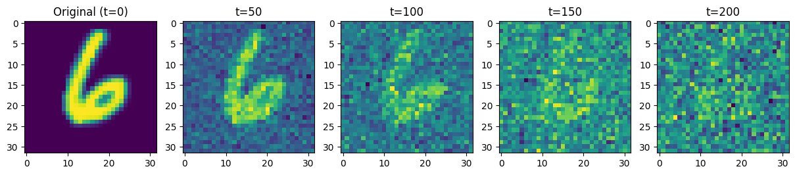
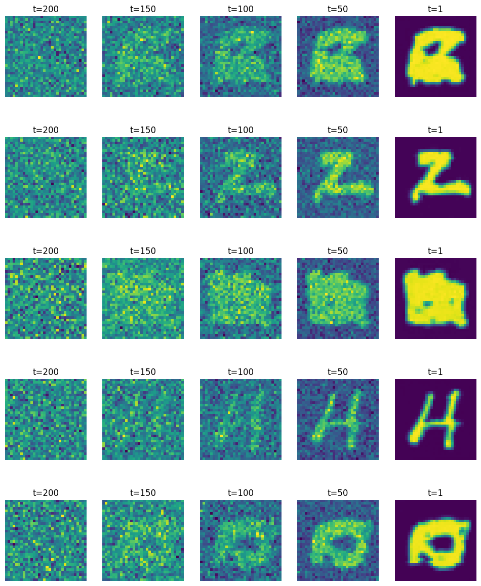

# Denoising Diffusion Models in PyTorch

I had come across diffusion in my undergraduate course in Mechanics. As a Physics major, I am super excited about the field's contribution to the emerging field of CS and AI. Having worked extensively with generative models like GANs and VAEs in the past, my recent focus is motivated towards this promising new paradigm, Physics based NNs. THe Denoising Diffusion Probabilistic Models (DDPMs) is a great start to this journey. 

Unlike the adversarial tug-of-war in GANs or the encoder-decoder structure of VAEs, diffusion models present an elegantly simple, two-step process inspired by non-equilibrium thermodynamics. The core concept involves a **forward process**, where we systematically corrupt data (e.g., an image) by adding Gaussian noise over a series of timesteps. This process is fixed and requires no training. The magic lies in the **reverse process**, where we train a neural network—typically a U-Net—to learn how to reverse this corruption, step by step. By starting with pure noise and iteratively applying our trained denoiser, we can generate a novel sample from the original data distribution.

This investigation documents my initial tinkering into this architecture, building it from first principles. The objective is to build a simple diffusion model from the ground up using PyTorch, applying it to the classic MNIST dataset. My goal is to deconstruct the mechanics, understand the role of the noise schedule and the U-Net denoiser and verify the model's generative capabilities. I am drawing inspiration from the foundational paper by Ho et al. (2020) and the clean implementations found in resources like the `denoising-diffusion-pytorch` library.

## 1. Setup

First, we'll import the necessary libraries and set up our environment. As usual, we'll use `torch` for building and training the model, `torchvision` for the dataset, and `matplotlib` for visualization.


```python
import torch
import torch.nn as nn
import torch.nn.functional as F
import torchvision
from torchvision import transforms
from torch.utils.data import DataLoader
from torchvision.utils import make_grid

import numpy as np
import matplotlib.pyplot as plt
from tqdm import tqdm
import math

# For reproducibility
SEED = 123
torch.manual_seed(SEED)
np.random.seed(SEED)

device = torch.device("cuda" if torch.cuda.is_available() else "cpu")
print(f"Using device: {device}")
```

    Using device: cuda


## 2. The Forward Process (Noising)

The forward process, or diffusion process, is defined by a fixed Markov chain that gradually adds Gaussian noise to an initial data point $x_0$ over $T$ timesteps. The step-by-step transition is given by:

$$ q(x_t | x_{t-1}) = \mathcal{N}(x_t; \sqrt{1 - \beta_t}x_{t-1}, \beta_t \mathbf{I}) $$

Here, $\beta_t$ is a small positive constant at each timestep $t$, defining the variance schedule. As $t$ increases, more noise is added.

A key property of this process is that we can sample $x_t$ at any arbitrary timestep $t$ directly from $x_0$, without having to iterate through all intermediate steps. This is known as the closed-form solution:

$$ q(x_t | x_0) = \mathcal{N}(x_t; \sqrt{\bar{\alpha}_t}x_0, (1 - \bar{\alpha}_t)\mathbf{I}) $$

where $\alpha_t = 1 - \beta_t$ and $\bar{\alpha}_t = \prod_{i=1}^{t} \alpha_i$. This equation is fundamental for efficient training, as it allows us to generate a noisy sample $x_t$ for any $t$ in a single step.

We'll start by defining the variance schedule. A simple linear schedule from $\beta_{start}=10^{-4}$ to $\beta_{end}=0.02$ over $T=200$ steps works well for MNIST.


```python
def linear_beta_schedule(timesteps, start=0.0001, end=0.02):
    return torch.linspace(start, end, timesteps)

# Define hyperparameters
TIMESTEPS = 200
betas = linear_beta_schedule(timesteps=TIMESTEPS).to(device)

# Pre-calculate the terms for the closed-form solution
alphas = 1. - betas
alphas_cumprod = torch.cumprod(alphas, axis=0)
alphas_cumprod_prev = F.pad(alphas_cumprod[:-1], (1, 0), value=1.0)
sqrt_recip_alphas = torch.sqrt(1.0 / alphas)
sqrt_alphas_cumprod = torch.sqrt(alphas_cumprod)
sqrt_one_minus_alphas_cumprod = torch.sqrt(1. - alphas_cumprod)
posterior_variance = betas * (1. - alphas_cumprod_prev) / (1. - alphas_cumprod)

# Helper function to extract the correct value for a batch of timesteps
def extract(a, t, x_shape):
    batch_size = t.shape[0]
    #out = a.gather(-1, t.cpu())
    out = a.to(t.device).gather(-1, t)
    return out.reshape(batch_size, *((1,) * (len(x_shape) - 1))).to(t.device)

# The forward noising function (q_sample)
def q_sample(x_start, t, noise=None):
    if noise is None:
        noise = torch.randn_like(x_start)

    sqrt_alphas_cumprod_t = extract(sqrt_alphas_cumprod, t, x_start.shape)
    sqrt_one_minus_alphas_cumprod_t = extract(
        sqrt_one_minus_alphas_cumprod, t, x_start.shape
    )

    return sqrt_alphas_cumprod_t * x_start + sqrt_one_minus_alphas_cumprod_t * noise
```

### Visualizing the Forward Process

Let's see what this looks like. We'll take an image from the MNIST dataset and apply the `q_sample` function at different timesteps.


```python
# Load dataset
transform = transforms.Compose([
    transforms.Resize((32, 32)),
    transforms.ToTensor(),
    transforms.Lambda(lambda t: (t * 2) - 1) # Scale to [-1, 1]
])
dataset = torchvision.datasets.MNIST(root="./data", train=True, download=True, transform=transform)
dataloader = DataLoader(dataset, batch_size=1, shuffle=True)

# Get a single image
image = next(iter(dataloader))[0]

def show_tensor_image(image, ax=plt):
    reverse_transforms = transforms.Compose([
        transforms.Lambda(lambda t: (t + 1) / 2),
        transforms.Lambda(lambda t: t.permute(1, 2, 0)), # C, H, W -> H, W, C
        transforms.Lambda(lambda t: t.cpu().numpy())
    ])
    ax.imshow(reverse_transforms(image))

plt.figure(figsize=(15,3))
plt.subplot(1, 5, 1)
plt.title("Original (t=0)")
show_tensor_image(image[0])

for i, t in enumerate([49, 99, 149, 199]):
    noisy_image = q_sample(image, torch.tensor([t]))
    plt.subplot(1, 5, i + 2)
    plt.title(f"t={t+1}")
    show_tensor_image(noisy_image[0])
plt.show()
```


    

    


As expected, the image progressively dissolves into noise. The goal of our model is to learn how to reverse this process.

## 3. The Model (U-Net)

The heart of the reverse process is a model that can predict the noise $\epsilon$ that was added to an image $x_0$ to produce $x_t$, given the noisy image $x_t$ and the timestep $t$. The architecture of choice for this task is almost universally the **U-Net**.

Its structure is ideal for image-to-image tasks. The downsampling path captures contextual information, while the upsampling path performs localization. Crucially, the skip connections between corresponding layers in the down- and up-sampling paths allow the model to pass fine-grained details from earlier layers directly to deeper layers, which is vital for high-fidelity reconstruction.

A critical component is how we inform the model about the timestep $t$. A simple integer is not an effective input for a neural network. Instead, we borrow a technique from the Transformer architecture we worked on recently: The **sinusoidal positional embeddings**. We transform the timestep $t$ into a high-dimensional vector that the network can easily interpret.

Let's define the building blocks for our U-Net.


```python
class SinusoidalPositionEmbeddings(nn.Module):
    def __init__(self, dim):
        super().__init__()
        self.dim = dim

    def forward(self, time):
        device = time.device
        half_dim = self.dim // 2
        embeddings = math.log(10000) / (half_dim - 1)
        embeddings = torch.exp(torch.arange(half_dim, device=device) * -embeddings)
        embeddings = time[:, None] * embeddings[None, :]
        embeddings = torch.cat((embeddings.sin(), embeddings.cos()), dim=-1)
        return embeddings

class Block(nn.Module):
    def __init__(self, in_ch, out_ch, time_emb_dim, up=False):
        super().__init__()
        self.time_mlp =  nn.Linear(time_emb_dim, out_ch)
        if up:
            self.conv1 = nn.Conv2d(2*in_ch, out_ch, 3, padding=1)
            self.transform = nn.ConvTranspose2d(out_ch, out_ch, 4, 2, 1)
        else:
            self.conv1 = nn.Conv2d(in_ch, out_ch, 3, padding=1)
            self.transform = nn.Conv2d(out_ch, out_ch, 4, 2, 1)
        self.conv2 = nn.Conv2d(out_ch, out_ch, 3, padding=1)
        self.bn1 = nn.BatchNorm2d(out_ch)
        self.bn2 = nn.BatchNorm2d(out_ch)
        self.relu  = nn.ReLU()
        
    def forward(self, x, t, ):
        # First Conv
        h = self.bn1(self.relu(self.conv1(x)))
        # Time embedding
        time_emb = self.relu(self.time_mlp(t))
        # Extend last 2 dimensions
        time_emb = time_emb[(..., ) + (None, ) * 2]
        # Add time channel
        h = h + time_emb
        # Second Conv
        h = self.bn2(self.relu(self.conv2(h)))
        # Down or Upsample
        return self.transform(h)

class SimpleUnet(nn.Module):
    """
    A simplified U-Net architecture for demonstration.
    """
    def __init__(self):
        super().__init__()
        image_channels = 1
        down_channels = (64, 128, 256, 512, 1024)
        up_channels = (1024, 512, 256, 128, 64)
        out_dim = 1 
        time_emb_dim = 32

        # Time embedding
        self.time_mlp = nn.Sequential(
                SinusoidalPositionEmbeddings(time_emb_dim),
                nn.Linear(time_emb_dim, time_emb_dim),
                nn.ReLU()
            )
        
        # Initial projection
        self.conv0 = nn.Conv2d(image_channels, down_channels[0], 3, padding=1)

        # Downsampling
        self.downs = nn.ModuleList([Block(down_channels[i], down_channels[i+1], \
                                    time_emb_dim) \
                    for i in range(len(down_channels)-1)])
        # Upsampling
        self.ups = nn.ModuleList([Block(up_channels[i], up_channels[i+1], \
                                        time_emb_dim, up=True) \
                    for i in range(len(up_channels)-1)])

        self.output = nn.Conv2d(up_channels[-1], image_channels, 1)

    def forward(self, x, timestep):
        # Embedd time
        t = self.time_mlp(timestep)
        # Initial conv
        x = self.conv0(x)
        # Unet
        residual_inputs = []
        for down in self.downs:
            x = down(x, t)
            residual_inputs.append(x)
        for up in self.ups:
            residual_x = residual_inputs.pop()
            # Add residual x as additional channels
            x = torch.cat((x, residual_x), dim=1)           
            x = up(x, t)
        return self.output(x)
```

## 4. Training

The training objective is remarkably straightforward. We sample a random timestep $t$ for each image in a batch, create a noisy version $x_t$ using our `q_sample` function, and then ask the U-Net to predict the noise that was added. The loss is simply the Mean Squared Error (MSE) between the true noise and the predicted noise.

$$ \mathcal{L} = \mathbb{E}_{t, x_0, \epsilon} \left[ ||\epsilon - \epsilon_\theta(\sqrt{\bar{\alpha}_t}x_0 + \sqrt{1-\bar{\alpha}_t}\epsilon, t)||^2 \right] $$


```python
# Create the model
model = SimpleUnet().to(device)

# Define loss and optimizer
optimizer = torch.optim.Adam(model.parameters(), lr=1e-3)
criterion = nn.MSELoss()

# Redefine dataloader for training
BATCH_SIZE = 128
dataloader = DataLoader(dataset, batch_size=BATCH_SIZE, shuffle=True, drop_last=True)

# Training loop
epochs = 20
for epoch in range(epochs):
    pbar = tqdm(dataloader)
    for step, (images, _) in enumerate(pbar):
        optimizer.zero_grad()

        images = images.to(device)
        t = torch.randint(0, TIMESTEPS, (BATCH_SIZE,), device=device).long()
        
        # Get noisy images and the noise added
        noise = torch.randn_like(images)
        x_noisy = q_sample(x_start=images, t=t, noise=noise)
        
        # Predict the noise
        predicted_noise = model(x_noisy, t)
        
        # Calculate loss
        loss = criterion(noise, predicted_noise)
        loss.backward()
        optimizer.step()

        pbar.set_description(f"Epoch {epoch+1}/{epochs} | Loss: {loss.item():.4f}")

# Save the model
torch.save(model.state_dict(), "diffusion_mnist.pth")
```

    Epoch 1/20 | Loss: 0.0515: 100%|█████████████████████████████████████████████████████████████████████████████████████████████████████████████████████████| 468/468 [00:47<00:00,  9.85it/s]
    Epoch 2/20 | Loss: 0.0423: 100%|█████████████████████████████████████████████████████████████████████████████████████████████████████████████████████████| 468/468 [00:43<00:00, 10.70it/s]
    Epoch 3/20 | Loss: 0.0382: 100%|█████████████████████████████████████████████████████████████████████████████████████████████████████████████████████████| 468/468 [00:46<00:00, 10.07it/s]
    Epoch 4/20 | Loss: 0.0403: 100%|█████████████████████████████████████████████████████████████████████████████████████████████████████████████████████████| 468/468 [00:45<00:00, 10.40it/s]
    Epoch 5/20 | Loss: 0.0404: 100%|█████████████████████████████████████████████████████████████████████████████████████████████████████████████████████████| 468/468 [00:47<00:00,  9.95it/s]
    Epoch 6/20 | Loss: 0.0369: 100%|█████████████████████████████████████████████████████████████████████████████████████████████████████████████████████████| 468/468 [00:44<00:00, 10.57it/s]
    Epoch 7/20 | Loss: 0.0350: 100%|█████████████████████████████████████████████████████████████████████████████████████████████████████████████████████████| 468/468 [00:47<00:00,  9.77it/s]
    Epoch 8/20 | Loss: 0.0320: 100%|█████████████████████████████████████████████████████████████████████████████████████████████████████████████████████████| 468/468 [00:46<00:00, 10.17it/s]
    Epoch 9/20 | Loss: 0.0424: 100%|█████████████████████████████████████████████████████████████████████████████████████████████████████████████████████████| 468/468 [00:48<00:00,  9.65it/s]
    Epoch 10/20 | Loss: 0.0331: 100%|████████████████████████████████████████████████████████████████████████████████████████████████████████████████████████| 468/468 [00:48<00:00,  9.71it/s]
    Epoch 11/20 | Loss: 0.0346: 100%|████████████████████████████████████████████████████████████████████████████████████████████████████████████████████████| 468/468 [00:46<00:00, 10.15it/s]
    Epoch 12/20 | Loss: 0.0348: 100%|████████████████████████████████████████████████████████████████████████████████████████████████████████████████████████| 468/468 [00:48<00:00,  9.66it/s]
    Epoch 13/20 | Loss: 0.0303: 100%|████████████████████████████████████████████████████████████████████████████████████████████████████████████████████████| 468/468 [00:44<00:00, 10.52it/s]
    Epoch 14/20 | Loss: 0.0312: 100%|████████████████████████████████████████████████████████████████████████████████████████████████████████████████████████| 468/468 [00:45<00:00, 10.27it/s]
    Epoch 15/20 | Loss: 0.0313: 100%|████████████████████████████████████████████████████████████████████████████████████████████████████████████████████████| 468/468 [00:48<00:00,  9.62it/s]
    Epoch 16/20 | Loss: 0.0333: 100%|████████████████████████████████████████████████████████████████████████████████████████████████████████████████████████| 468/468 [00:48<00:00,  9.70it/s]
    Epoch 17/20 | Loss: 0.0358: 100%|████████████████████████████████████████████████████████████████████████████████████████████████████████████████████████| 468/468 [00:47<00:00,  9.94it/s]
    Epoch 18/20 | Loss: 0.0304: 100%|████████████████████████████████████████████████████████████████████████████████████████████████████████████████████████| 468/468 [00:45<00:00, 10.18it/s]
    Epoch 19/20 | Loss: 0.0322: 100%|████████████████████████████████████████████████████████████████████████████████████████████████████████████████████████| 468/468 [00:47<00:00,  9.79it/s]
    Epoch 20/20 | Loss: 0.0292: 100%|████████████████████████████████████████████████████████████████████████████████████████████████████████████████████████| 468/468 [00:45<00:00, 10.27it/s]


## 5. Sampling (Inference)

Now comes the exciting part i.e. generating new images. We start with pure Gaussian noise, $x_T \sim \mathcal{N}(0, \mathbf{I})$, and iteratively apply our model to denoise it, one step at a time, from $t=T$ down to $t=1$.

The equation for one step of the reverse process is:
$$ x_{t-1} = \frac{1}{\sqrt{\alpha_t}} \left( x_t - \frac{1-\alpha_t}{\sqrt{1-\bar{\alpha}_t}} \epsilon_\theta(x_t, t) \right) + \sigma_t \mathbf{z} $$
where $\mathbf{z}$ is Gaussian noise, and $\sigma_t$ is the variance of the posterior.

We implement the sampling loop.


```python
@torch.no_grad()
def p_sample(model, x, t, t_index):
    betas_t = extract(betas, t, x.shape)
    sqrt_one_minus_alphas_cumprod_t = extract(
        sqrt_one_minus_alphas_cumprod, t, x.shape
    )
    sqrt_recip_alphas_t = extract(sqrt_recip_alphas, t, x.shape)
    
    # Equation 11 in the paper
    # Use our model (noise predictor) to predict the mean
    model_mean = sqrt_recip_alphas_t * (
        x - betas_t * model(x, t) / sqrt_one_minus_alphas_cumprod_t
    )

    if t_index == 0:
        return model_mean
    else:
        posterior_variance_t = extract(posterior_variance, t, x.shape)
        noise = torch.randn_like(x)
        # Algorithm 2 line 4:
        return model_mean + torch.sqrt(posterior_variance_t) * noise 

@torch.no_grad()
def p_sample_loop(model, shape):
    device = next(model.parameters()).device

    b = shape[0]
    # start from pure noise (for each example in the batch)
    img = torch.randn(shape, device=device)
    imgs = []

    for i in tqdm(reversed(range(0, TIMESTEPS)), desc='sampling loop time step', total=TIMESTEPS):
        img = p_sample(model, img, torch.full((b,), i, device=device, dtype=torch.long), i)
        imgs.append(img.cpu())
    return imgs

# Load the trained model
model.load_state_dict(torch.load("diffusion_mnist.pth"))
model.eval()

# Generate 64 images
num_images = 64
sample_shape = (num_images, 1, 32, 32)
samples = p_sample_loop(model, shape=sample_shape)

# Show the final generated images
final_samples = samples[-1]
grid = make_grid(final_samples, nrow=8, normalize=True, value_range=(-1, 1))

plt.figure(figsize=(8,8))
plt.axis('off')
plt.imshow(grid.permute(1, 2, 0))
plt.show()
```

    /tmp/ipykernel_363682/1693727068.py:38: FutureWarning: You are using `torch.load` with `weights_only=False` (the current default value), which uses the default pickle module implicitly. It is possible to construct malicious pickle data which will execute arbitrary code during unpickling (See https://github.com/pytorch/pytorch/blob/main/SECURITY.md#untrusted-models for more details). In a future release, the default value for `weights_only` will be flipped to `True`. This limits the functions that could be executed during unpickling. Arbitrary objects will no longer be allowed to be loaded via this mode unless they are explicitly allowlisted by the user via `torch.serialization.add_safe_globals`. We recommend you start setting `weights_only=True` for any use case where you don't have full control of the loaded file. Please open an issue on GitHub for any issues related to this experimental feature.
      model.load_state_dict(torch.load("diffusion_mnist.pth"))
    sampling loop time step: 100%|███████████████████████████████████████████████████████████████████████████████████████████████████████████████████████████| 200/200 [00:02<00:00, 99.80it/s]


    

    


We can also visualize the entire generation process for a individual images.


```python
# Show the generation process
fig, axes = plt.subplots(5, 5, figsize=(12, 15))
for i, t in enumerate([0, 50, 100, 150, 199]):
    for j in range(5):
        ax = axes[j][i]
        ax.axis('off')
        ax.set_title(f"t={TIMESTEPS - t}")
        show_tensor_image(samples[t][j],ax)
plt.show()
```


    

    


## 6. Conclusion

This initial implementation of diffusion on MNIST has been very instructive. I am clear on the core mechanics of diffusion models: the fixed forward noising process and the learned, iterative reverse denoising process. The U-Net's role as a conditional noise predictor is clear, and the results, even with this simple setup, are quite coherent.

**Limitations & Future Work:**

1.  **Dataset & Model Complexity**: This was a toy example on MNIST. Applying this to more complex datasets like CIFAR-10 or CelebA would require a more sophisticated U-Net with attention mechanisms.
2.  **Noise Schedule**: We used a simple linear schedule. The original DDPM paper found that a cosine schedule can improve results.
3.  **Sampling Speed**: The iterative sampling process is slow (200 steps in our case). More advanced samplers like Denoising Diffusion Implicit Models (DDIM) can produce high-quality samples in far fewer steps.
4.  **Conditional Generation**: Our model is unconditional. A next step would be to guide the generation process by conditioning it on class labels (e.g., "generate a '7'").

This exercise served as a strong foundation for exploring these more advanced topics in the fascinating and rapidly-evolving field of Physics inspired ML/AI.
