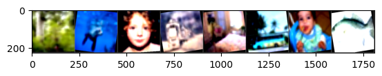

# Vision Transformer (ViT) for Image Classification
Having explored the Transformer architecture from the ground up in our [previous project on machine translation](https://github.com/mbastola/neural-nets-in-python/tree/main/advanced-concepts/attention), and later applying PyTorch's built-in modules to a [Nepali-to-English translation task](https://github.com/mbastola/neural-nets-in-python/tree/main/advanced-concepts/machine-translation), we now turn our attention to Computer Vision. The paper "An Image is Worth 16x16 Words" introduced the Vision Transformer (ViT), which applies the transformer architecture (highly successful in NLP) directly to sequences of image patches.

This exercise documents my research into fine-tuning a pre-trained ViT model for classification on the CIFAR-100 dataset. The goal is not to rebuild the ViT from scratch as we did the multi-headed attention architecture, as the hardware constraint tied to it limits us as well as the main concepts from language to vision are fairly similar (positional encoding, multi-headed-attn, etc). The goal of this project is to understand the practical aspects of applying these models to vision tasks and to verify for ourselves if and how the self-attention mechanism can effectively learn representations from image data, just as it does for text.

As usual, we'll import the necessary libraries. We'll be using `torch` and `torchvision` for the model and data handling, `matplotlib` for visualization, and `numpy` for some utility operations. We'll also set a random seed for reproducibility, a practice we've carried over from our previous experiments.


```python
#install the required module
!pip install torchvision --quiet
```


```python
import torch
import torch.nn as nn
import torch.optim as optim
from torch.utils.data import DataLoader
import torchvision
import torchvision.transforms as transforms
from torchvision.models import vit_b_16, ViT_B_16_Weights

import numpy as np
import matplotlib.pyplot as plt
import time
import random

# For reproducibility
SEED = 42
random.seed(SEED)
np.random.seed(SEED)
torch.manual_seed(SEED)
torch.cuda.manual_seed(SEED)
torch.backends.cudnn.deterministic = True

device = torch.device('cuda' if torch.cuda.is_available() else 'cpu')
print(f"Using device: {device}")
```

    Using device: cuda


## Data Loading and Preprocessing

We'll use the CIFAR-100 dataset, which consists of 60,000 32x32 color images in 100 classes, with 600 images per class. There are 500 training images and 100 testing images per class.

The pre-trained ViT model (`vit_b_16`) expects images of size 224x224. Therefore, we need to define a series of transformations:
1.  **Resize**: Upscale the 32x32 images to 224x224.
2.  **Data Augmentation**: Apply random horizontal flips and rotations to the training data to improve model robustness.
3.  **ToTensor**: Convert the images to PyTorch tensors.
4.  **Normalize**: Normalize the tensor images using the mean and standard deviation from the ImageNet dataset, on which the ViT model was pre-trained. This is a crucial step in transfer learning.


```python
# Use the weights' recommended transforms
weights = ViT_B_16_Weights.IMAGENET1K_V1
preprocess = weights.transforms()
print("ViT Preprocessing Transforms:")
print(preprocess)

# For training, we'll add some data augmentation
train_transform = transforms.Compose([
    transforms.Resize((224, 224)),
    transforms.RandomHorizontalFlip(),
    transforms.RandomRotation(10),
    transforms.ToTensor(),
    transforms.Normalize(mean=[0.485, 0.456, 0.406], std=[0.229, 0.224, 0.225]),
])

# For validation/testing, we use the standard preprocessing without augmentation
test_transform = preprocess

# Download and load the training and test datasets
train_dataset = torchvision.datasets.CIFAR100(root='./data', train=True, download=True, transform=train_transform)
test_dataset = torchvision.datasets.CIFAR100(root='./data', train=False, download=True, transform=test_transform)

BATCH_SIZE = 64

train_loader = DataLoader(train_dataset, batch_size=BATCH_SIZE, shuffle=True)
test_loader = DataLoader(test_dataset, batch_size=BATCH_SIZE, shuffle=False)
```

    ViT Preprocessing Transforms:
    ImageClassification(
        crop_size=[224]
        resize_size=[256]
        mean=[0.485, 0.456, 0.406]
        std=[0.229, 0.224, 0.225]
        interpolation=InterpolationMode.BILINEAR
    )
    Downloading https://www.cs.toronto.edu/~kriz/cifar-100-python.tar.gz to ./data/cifar-100-python.tar.gz


    100%|██████████████████████████████████████████████████████████████| 169001437/169001437 [00:39<00:00, 4275714.97it/s]


    Extracting ./data/cifar-100-python.tar.gz to ./data
    Files already downloaded and verified


### Visualizing the Data


```python
def imshow(img):
    img = img / 2 + 0.5  # Unnormalize
    npimg = img.numpy()
    plt.imshow(np.transpose(npimg, (1, 2, 0)))
    plt.show()

classes = train_dataset.classes

# Get some random training images
dataiter = iter(train_loader)
images, labels = next(dataiter)

# Show images
print('Example images:')
imshow(torchvision.utils.make_grid(images[:8]))
# Print labels
print('Labels: ', ' '.join(f'{classes[labels[j]]:5s}' for j in range(8)))

imshow(torchvision.utils.make_grid(images[8:16]))
# Print labels
print('Labels: ', ' '.join(f'{classes[labels[j]]:5s}' for j in range(8,16)))
```

    Clipping input data to the valid range for imshow with RGB data ([0..1] for floats or [0..255] for integers). Got range [-0.558952..1.82].


    Example images:


    

    


    Clipping input data to the valid range for imshow with RGB data ([0..1] for floats or [0..255] for integers). Got range [-0.558952..1.82].


    Labels:  worm  bowl  pickup_truck skunk bowl  mountain fox   elephant


    

    


    Labels:  forest seal  girl  train bed   bus   baby  trout


## 3. Model Architecture and Transfer Learning

The core of our experiment is the Vision Transformer. Instead of building it from scratch, we'll leverage transfer learning by using a model pre-trained on the massive ImageNet dataset. This allows us to use the powerful feature representations learned by the model on a large-scale dataset and adapt them to our specific task. We will follow the following standard strategy of transfer learning in neural nets:

1.  **Load `vit_b_16`**: We load the base ViT model with its pre-trained ImageNet weights.
2.  **Modify the Head**: The original model has a classification head for ImageNet's 1000 classes. We will replace this with a new `nn.Linear` layer that outputs 100 scores, corresponding to the number of classes in CIFAR-100.
3.  **Fine-Tuning**: We will freeze the weights of the initial patch embedding and most of the transformer encoder blocks. We will only train (or "fine-tune") the final few encoder blocks and our newly added classification head. This approach is memory-efficient and helps prevent overfitting by only updating the most task-specific layers.


```python
model = vit_b_16(weights=ViT_B_16_Weights.IMAGENET1K_V1)

# Freeze all the parameters in the model
for param in model.parameters():
    param.requires_grad = False

# Unfreeze the parameters of the last 3 encoder layers
for i in range(-3, 0):
    for param in model.encoder.layers[i].parameters():
        param.requires_grad = True

# Replace the classification head
num_classes = 100
in_features = model.heads.head.in_features
model.heads.head = nn.Linear(in_features, num_classes)

# Ensure the new head's parameters are trainable
for param in model.heads.parameters():
    param.requires_grad = True

model = model.to(device)

# Let's see how many parameters are trainable
trainable_params = sum(p.numel() for p in model.parameters() if p.requires_grad)
total_params = sum(p.numel() for p in model.parameters())
print(f"Trainable parameters: {trainable_params:,} / {total_params:,} ({100 * trainable_params / total_params:.2f}%)")
```

    Downloading: "https://download.pytorch.org/models/vit_b_16-c867db91.pth" to /home/mbastola/.cache/torch/hub/checkpoints/vit_b_16-c867db91.pth
    100%|██████████████████████████████████████████████████████████████████████████████| 330M/330M [01:13<00:00, 4.71MB/s]


    Trainable parameters: 21,340,516 / 85,875,556 (24.85%)


## Training the Model

With the data and model prepared, we set up the training loop. We'll use the Adam optimizer, a standard choice for transformer-based models, and the Cross-Entropy Loss, which is suitable for multi-class classification.


```python
criterion = nn.CrossEntropyLoss()
optimizer = optim.Adam(model.parameters(), lr=0.001)

def train_one_epoch(model, loader, criterion, optimizer, device):
    model.train()
    running_loss = 0.0
    correct = 0
    total = 0
    
    for i, (inputs, labels) in enumerate(loader):
        inputs, labels = inputs.to(device), labels.to(device)

        optimizer.zero_grad()

        outputs = model(inputs)
        loss = criterion(outputs, labels)
        loss.backward()
        optimizer.step()

        running_loss += loss.item()
        _, predicted = torch.max(outputs.data, 1)
        total += labels.size(0)
        correct += (predicted == labels).sum().item()
        
        if (i + 1) % 100 == 0:
            print(f'  Batch {i + 1}/{len(loader)}, Loss: {loss.item():.4f}')

    epoch_loss = running_loss / len(loader)
    epoch_acc = 100 * correct / total
    return epoch_loss, epoch_acc

def evaluate(model, loader, criterion, device):
    model.eval()
    running_loss = 0.0
    correct = 0
    total = 0
    with torch.no_grad():
        for inputs, labels in loader:
            inputs, labels = inputs.to(device), labels.to(device)
            outputs = model(inputs)
            loss = criterion(outputs, labels)
            
            running_loss += loss.item()
            _, predicted = torch.max(outputs.data, 1)
            total += labels.size(0)
            correct += (predicted == labels).sum().item()
            
    epoch_loss = running_loss / len(loader)
    epoch_acc = 100 * correct / total
    return epoch_loss, epoch_acc
```


```python
num_epochs = 5
train_losses, train_accs = [], []
test_losses, test_accs = [], []

for epoch in range(num_epochs):
    start_time = time.time()
    print(f"--- Epoch {epoch+1}/{num_epochs} ---")
    
    train_loss, train_acc = train_one_epoch(model, train_loader, criterion, optimizer, device)
    test_loss, test_acc = evaluate(model, test_loader, criterion, device)
    
    train_losses.append(train_loss)
    train_accs.append(train_acc)
    test_losses.append(test_loss)
    test_accs.append(test_acc)
    
    end_time = time.time()
    epoch_mins = int((end_time - start_time) / 60)
    epoch_secs = int((end_time - start_time) - (epoch_mins * 60))
    
    print(f'Epoch: {epoch+1:02} | Time: {epoch_mins}m {epoch_secs}s')
    print(f'\tTrain Loss: {train_loss:.3f} | Train Acc: {train_acc:.2f}%')
    print(f'\t Val. Loss: {test_loss:.3f} |  Val. Acc: {test_acc:.2f}%')
```

    --- Epoch 1/5 ---
      Batch 100/782, Loss: 1.0355
      Batch 200/782, Loss: 1.0049
      Batch 300/782, Loss: 0.7483
      Batch 400/782, Loss: 0.6489
      Batch 500/782, Loss: 0.8019
      Batch 600/782, Loss: 0.7167
      Batch 700/782, Loss: 0.7018
    Epoch: 01 | Time: 7m 0s
    	Train Loss: 0.891 | Train Acc: 74.08%
    	 Val. Loss: 0.714 |  Val. Acc: 78.95%
    --- Epoch 2/5 ---
      Batch 100/782, Loss: 0.5270
      Batch 200/782, Loss: 0.8079
      Batch 300/782, Loss: 0.6731
      Batch 400/782, Loss: 0.5747
      Batch 500/782, Loss: 0.4237
      Batch 600/782, Loss: 0.5067
      Batch 700/782, Loss: 0.4832
    Epoch: 02 | Time: 7m 0s
    	Train Loss: 0.510 | Train Acc: 84.13%
    	 Val. Loss: 0.679 |  Val. Acc: 79.96%
    --- Epoch 3/5 ---
      Batch 100/782, Loss: 0.1797
      Batch 200/782, Loss: 0.4245
      Batch 300/782, Loss: 0.2737
      Batch 400/782, Loss: 0.3224
      Batch 500/782, Loss: 0.3561
      Batch 600/782, Loss: 0.3865
      Batch 700/782, Loss: 0.3683
    Epoch: 03 | Time: 6m 58s
    	Train Loss: 0.381 | Train Acc: 87.89%
    	 Val. Loss: 0.692 |  Val. Acc: 80.16%
    --- Epoch 4/5 ---
      Batch 100/782, Loss: 0.1484
      Batch 200/782, Loss: 0.2191
      Batch 300/782, Loss: 0.3490
      Batch 400/782, Loss: 0.2386
      Batch 500/782, Loss: 0.4132
      Batch 600/782, Loss: 0.3741
      Batch 700/782, Loss: 0.3287
    Epoch: 04 | Time: 7m 7s
    	Train Loss: 0.307 | Train Acc: 89.92%
    	 Val. Loss: 0.741 |  Val. Acc: 80.02%
    --- Epoch 5/5 ---
      Batch 100/782, Loss: 0.1500
      Batch 200/782, Loss: 0.1795
      Batch 300/782, Loss: 0.2967
      Batch 400/782, Loss: 0.1240
      Batch 500/782, Loss: 0.1339
      Batch 600/782, Loss: 0.4523
      Batch 700/782, Loss: 0.1248
    Epoch: 05 | Time: 7m 9s
    	Train Loss: 0.253 | Train Acc: 91.77%
    	 Val. Loss: 0.755 |  Val. Acc: 80.31%


## Results and Analysis

Let's plot the training and validation loss and accuracy to see how our model performed over the epochs.


```python
plt.figure(figsize=(12, 5))

plt.subplot(1, 2, 1)
plt.plot(train_losses, label='Train Loss')
plt.plot(test_losses, label='Test Loss')
plt.xlabel('Epochs')
plt.ylabel('Loss')
plt.title('Loss vs. Epochs')
plt.legend()
plt.grid(True)

plt.subplot(1, 2, 2)
plt.plot(train_accs, label='Train Accuracy')
plt.plot(test_accs, label='Test Accuracy')
plt.xlabel('Epochs')
plt.ylabel('Accuracy (%)')
plt.title('Accuracy vs. Epochs')
plt.legend()
plt.grid(True)

plt.tight_layout()
plt.show()
```


    

    


### Visualizing Predictions


```python
def visualize_predictions(model, loader, classes, device, num_images=16):
    model.eval()
    images, labels = next(iter(loader))
    images, labels = images.to(device), labels.to(device)

    outputs = model(images)
    _, predicted = torch.max(outputs, 1)

    images = images.cpu()
    
    plt.figure(figsize=(15, 15))
    for i in range(num_images):
        plt.subplot(4, 4, i + 1)
        img = images[i] / 2 + 0.5  # Unnormalize
        npimg = img.numpy()
        plt.imshow(np.transpose(npimg, (1, 2, 0)))
        
        true_label = classes[labels[i]]
        pred_label = classes[predicted[i]]
        color = "green" if true_label == pred_label else "red"
        
        plt.title(f"True: {true_label}\nPred: {pred_label}", color=color)
        plt.axis('off')
    plt.tight_layout()
    plt.show()

visualize_predictions(model, test_loader, classes, device)
```
    

    


## Conclusion

This experiment was a toy implementation of the ViT transformer in Computer Vision space. We demonstrates significant improvement in CIFAR100 prediction as compared to our older projects with CNN of applying a pre-trained Vision Transformer. By fine-tuning only the last few layers, we were able to achieve amazing performance (>80% in validation set) without the need for the extensive computational resources required to train a ViT from scratch. Note that we did no hyperparameter tuning or kfold. The self-attention mechanism, originally designed for sequential text data, proves to be hihgly effective at capturing spatial hierarchies and features within images.
