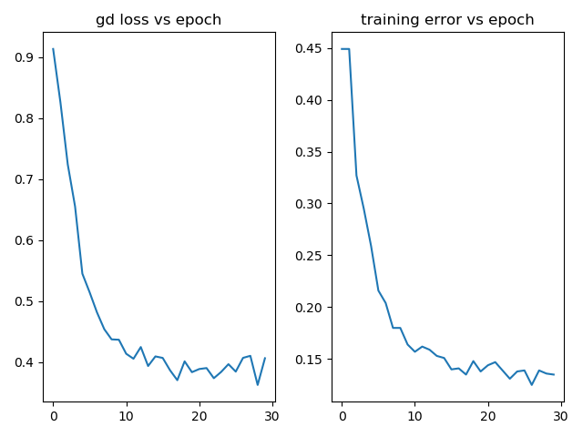
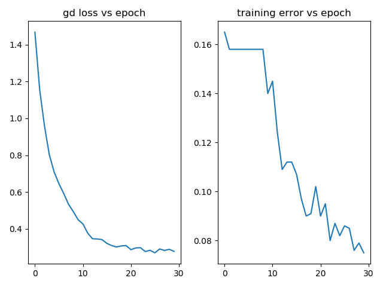
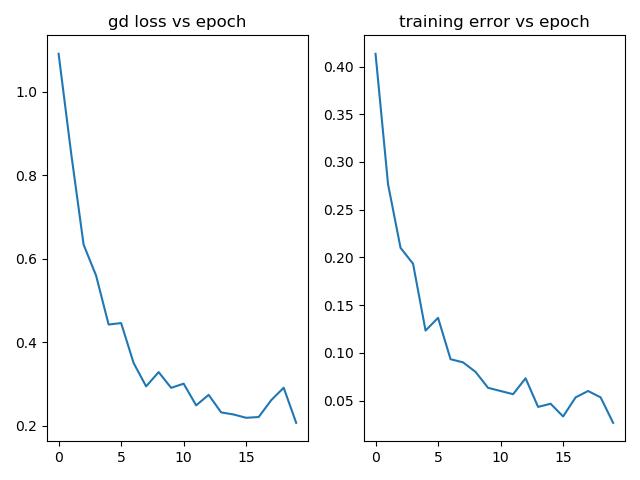

# Advanced Architecture CNN3D

In this repo, I extend my [CNN Advanced Architecture](https://github.com/mbastola/neural-nets-in-python/tree/master/convolutional-neural-nets/cnn-advanced-architecture) project to 3D space. The architecture is advanced in the sense that it is flexible and can read & build its architecture from JSON files. The 3D extension allows CNN3D classifier to tackle 3D image tensors such as CT Scan images which we will we working with in this repo. I train the LUNA16 dataset with the usual 2D CNN and then with CNN3D and note that CNN3D outperfroms the predictions for the dataset.  


## LUNA16:


## Data Exploration:


## Classification Results:

### CNN 2D

```
archsm = [
	{'type':'C','activation':'relu','num_output':16,'kernel_size': (3,3), 'stride': (1,1), 'drop_out': 8.3},
        {'type':'P','pool':'max','kernel_size': (2,2), 'stride': (2,2), 'drop_out': 16.7},
        {'type':'C','activation':'relu','num_output':32,'kernel_size': (3,3), 'stride': (1,1), 'drop_out': 0.0},
        {'type':'C','activation':'relu','num_output':16,'kernel_size': (5,5), 'stride': (1,1), 'drop_out':16.7},
        {'type':'P','pool':'max','kernel_size': (5,5), 'stride': (3,3), 'drop_out': 0.0},
        {'type':'C','activation':'relu','num_output':32,'kernel_size': (3,3), 'stride': (1,1), 'drop_out': 0.0},
        {'type':'FC','activation':'relu','num_output':20,'drop_out': 8.3},
        {'type':'FC','activation':'relu','num_output':10,'drop_out': 0.0}, 
        {'type':'T','activation':None}
    ]
```

For the architecture above the 2D CNN achieved the test accuracy of 90.6% (error 0.094). The recall, which we are the most interested in maximizing, was 78% for the positive class.   



```
final training error:  0.135
test error: 0.09450277949351452
```

Confusion Matrix:

```
 [[1248   90]
  [  63  218]]
```

Classification Report:

```


              precision    recall  f1-score   support

           0       0.95      0.93      0.94      1338
	   1       0.71      0.78      0.74       281
		
    accuracy                           0.91      1619
   macro avg       0.83      0.85      0.84      1619
weighted avg       0.91      0.91      0.91      1619
       
```


```
    arch = [
        {'type':'C','activation':'relu','num_output':64,'kernel_size': (3,3), 'stride': (1,1), 'drop_out': 8.3},
        {'type':'P','pool':'max','kernel_size': (2,2), 'stride': (2,2), 'drop_out': 16.7},
        {'type':'C','activation':'relu','num_output':128,'kernel_size': (3,3), 'stride': (1,1), 'drop_out': 0.0},
        {'type':'C','activation':'relu','num_output':64,'kernel_size': (5,5), 'stride': (1,1), 'drop_out':16.7},
        {'type':'P','pool':'max','kernel_size': (5,5), 'stride': (3,3), 'drop_out': 0.0},
        {'type':'C','activation':'relu','num_output':128,'kernel_size': (3,3), 'stride': (1,1), 'drop_out': 0.0},
        {'type':'FC','activation':'relu','num_output':20,'drop_out': 8.3},
        {'type':'FC','activation':'relu','num_output':10,'drop_out': 0.0}, 
        {'type':'T','activation':None}
    ]
```

Using feature sizes in the CNN kernel (see above) the 2D CNN achieved improved its test accuracy to 92.6% (error 0.074). The recall improved 85% for the positive class.   



```
final training error:  0.074
test error: 0.07782581840642372
```

Confusion Matrix:

```
[[1255   83]
  [  43  238]]
```

Classification Report:

```

              precision    recall  f1-score   support

           0       0.97      0.94      0.95      1338
	   1       0.74      0.85      0.79       281

    accuracy                           0.92      1619
   macro avg       0.85      0.89      0.87      1619
weighted avg       0.93      0.92      0.92      1619
       
```

### CNN3D

For 10 class 3 channel images CIFAR dataset the ANN archecture with 3 hidden layers of sizes [128, 64,32] produced test error is 61.3% (accuracy 38.7%). For the same architecture, adding just 2 conv pool layers with convolutions params (20,5,5) & pooling of strides (1,1) reduced test error to 31.5% (accuracy 68.5%!). I've optimized my CNNs to get this down to 18% test error in my CNN advanced architecture repo. 


We extend the archsm architecture above to 3D Conv & Pool kernels.

```
    arch3dsm = [
        {'type':'C','activation':'relu','num_output':16,'kernel_size': (3,3,3), 'stride': (1,1,1), 'drop_out': 8.3},
        {'type':'P','pool':'max','kernel_size': (2,2,2), 'stride': (2,2,2), 'drop_out': 16.7},
        {'type':'C','activation':'relu','num_output':32,'kernel_size': (3,3,3), 'stride': (1,1,1), 'drop_out': 0.0},
        {'type':'C','activation':'relu','num_output':16,'kernel_size': (5,5,1), 'stride': (1,1,1), 'drop_out':16.7},
        {'type':'P','pool':'max','kernel_size': (5,5,2), 'stride': (3,3,3), 'drop_out': 0.0},
        {'type':'C','activation':'relu','num_output':32,'kernel_size': (3,3,3), 'stride': (1,1,1), 'drop_out': 0.0},
        {'type':'FC','activation':'relu','num_output':20,'drop_out': 8.3},
        {'type':'FC','activation':'relu','num_output':10,'drop_out': 0.0}, 
        {'type':'T','activation':None}
    ]

``` 



final training error:  0.02666666666666667

test error: 0.08956145768993205

Confusion Matrix:
```
 [[1234  104]
  [  41  240]]
```
Classification Report:

```

              precision    recall  f1-score   support

           0       0.97      0.92      0.94      1338
	   1       0.70      0.85      0.77       281

    accuracy                           0.91      1619
       macro avg       0.83      0.89      0.86      1619
       weighted avg       0.92      0.91      0.91      1619
```

