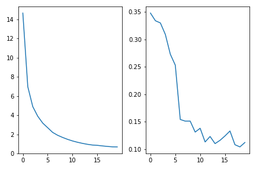
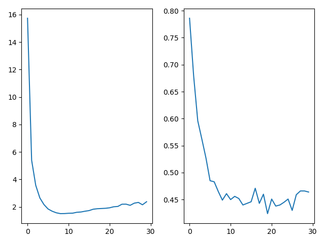
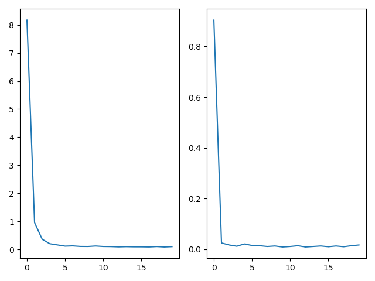
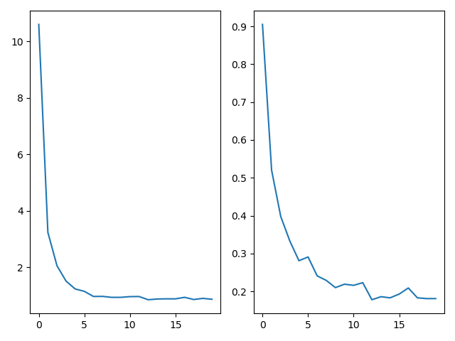
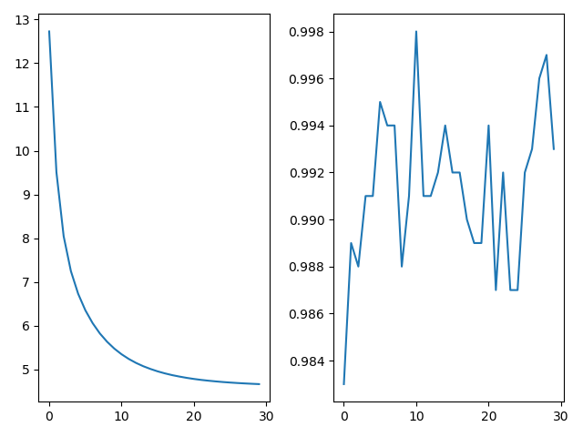

# CNN Advanced Architecture

In this repo, I made advancements to the CNN class I worked in [cnn-learning-hyper-params](https://github.com/mbastola/neural-nets-in-python/tree/master/convolutional-neural-nets/cnn-learning-hyper-params) repo. The motivation is to be able to build a CNN class that is flexible to architecture changes. For example, the CNN class in this repo reads its architecture from Json object. For example,

ARCH = [
        {'type':'C','activation':'relu','num_output':64,'kernel_size': (3,3), 'stride': (1,1), 'drop_out': 0.0},
        {'type':'C','activation':'relu','num_output':128,'kernel_size': (3,3), 'stride': (1,1), 'drop_out': 8.3},
        {'type':'P','pool':'max','kernel_size': (2,2), 'stride': (2,2), 'drop_out': 16.7},
        {'type':'C','activation':'relu','num_output':256,'kernel_size': (3,3), 'stride': (1,1), 'drop_out': 0.0},
        {'type':'C','activation':'relu','num_output':128,'kernel_size': (5,5), 'stride': (1,1), 'drop_out':16.7},
        {'type':'P','pool':'max','kernel_size': (5,5), 'stride': (3,3), 'drop_out': 0.0},
        {'type':'C','activation':'relu','num_output':256,'kernel_size': (3,3), 'stride': (1,1), 'drop_out': 0.0},
        {'type':'FC','activation':'relu','num_output':256,'drop_out': 8.3},
        {'type':'FC','activation':'relu','num_output':128,'drop_out': 0.0}, 
        {'type':'T','activation':None}
    ] 

builds the CNN with layers:

Conv -> Relu+Dropout -> Conv -> Relu+Dropout -> Max_pool -> Conv -> Relu -> Conv -> Relu+Dropout -> Max_pool -> Conv -> Relu -> Fully Connected -> Relu+Dropout -> Fully_Connected -> Relu -> Catergorical_Cross_Entropy

The goal is to utilize this dynamic architecture in my next repo [cnn-learning-architecture](https://github.com/mbastola/neural-nets-in-python/tree/master/convolutional-neural-nets/cnn-learning-architecture) where I plan to use Reinforcement Learning to learn the architecture params.

Another motivation is to imporove on the Facial Recognition result from the [cnn-learning-hyper-params](https://github.com/mbastola/neural-nets-in-python/tree/master/convolutional-neural-nets/cnn-learning-hyper-params) repo. There we were stuck with 36% test error for binary class FER2013 dataset. For the architecture above, we have improved on the dataset while also tested the result on MNIST and CIFAR.

## FER2013 Binary

Applying CNN with architecture defined by ARCH, the 2 class Facial Emotion FER2013 dataset result has significantly improved, decreasing test error from 36% to 13.6% leading to accuracy of 86.4%!

*Left: Losses, Right: training_error_rate*

training error_rate:  0.112
test error: 0.1357142857142857

Confusion Matrix:

	[[48  7]
	[12 73]]

Classification Report:

                  precision    recall  f1-score   support

		0       0.80      0.87      0.83        55
		1       0.91      0.86      0.88        85

		accuracy                           0.86       140
		macro avg       0.86      0.87      0.86       140
		weighted avg       0.87      0.86      0.87       140

## FER2013 7 classes

Applying CNN with architecture defined by ARCH, the 7 class Facial Emotion FER2013 dataset has test error of 41.7% (accuracy 58.22%). The leading Kaggle score for this dataset has accuracy of 69.7% [link](https://www.kaggle.com/c/challenges-in-representation-learning-facial-expression-recognition-challenge/leaderboard).

*Left: Losses, Right: training_error_rate*

training error_rate:  0.464
test error: 0.4178272980501393

Confusion Matrix:

	[[26  0  8  4  7  2  7]
 	[ 1  2  0  0  0  0  0]
 	[ 4  0 25  4  8  3 11]
 	[ 4  0  2 64  6  5  6]
 	[ 2  0 11  6 22  0  9]
 	[ 1  0  1  5  1 33  0]
 	[ 4  0 10  9  8  1 37]]

Classification Report:

              precision    recall  f1-score   support

           0       0.62      0.48      0.54        54
	   1       1.00      0.67      0.80         3
	   2       0.44      0.45      0.45        55
           3       0.70      0.74      0.72        87
	   4       0.42      0.44      0.43        50
	   5       0.75      0.80      0.78        41
           6       0.53      0.54      0.53        69

	accuracy                           0.58       359
	macro avg       0.64      0.59      0.61       359
	weighted avg       0.58      0.58      0.58       359

## MNIST:

Applying CNN with architecture defined by ARCH, the 10 class handwritten digit MNIST dataset has test error of 1.2% (accuracy 98.8% !!). The leading score for this dataset has accuracy of 99.8% and looks like ARCH ranks around 46th.

*Left: Losses, Right: training_error_rate*

training error_rate:  0.017
test error: 0.012857142857142857

Confusion Matrix:

	[[69  0  0  0  0  0  0  0  0  0]
    	[ 0 78  0  0  0  0  0  0  0  0]
    	[ 0  0 64  0  0  0  0  0  0  0]
    	[ 0  0  0 87  0  1  0  0  0  0]
    	[ 0  0  0  0 63  0  1  0  0  0]
    	[ 0  0  0  1  0 62  0  0  0  0]
    	[ 0  0  0  0  0  1 66  0  0  0]
    	[ 0  0  1  0  0  0  0 66  0  0]
    	[ 0  0  1  0  0  0  1  0 68  0]
    	[ 0  0  0  0  0  0  0  1  1 68]]

Classification Report:

                  precision    recall  f1-score   support
    
             0.0       1.00      1.00      1.00        69
             1.0       1.00      1.00      1.00        78
             2.0       0.97      1.00      0.98        64
             3.0       0.99      0.99      0.99        88
             4.0       1.00      0.98      0.99        64
             5.0       0.97      0.98      0.98        63
             6.0       0.97      0.99      0.98        67
             7.0       0.99      0.99      0.99        67
             8.0       0.99      0.97      0.98        70
             9.0       1.00      0.97      0.99        70
    
        accuracy                           0.99       700
       macro avg       0.99      0.99      0.99       700
    weighted avg       0.99      0.99      0.99       700

## CIFAR 10

Applying CNN with architecture defined by ARCH, the 10 class 3 channel images CIFAR dataset has test error of 18% (accuracy 88% !!). The leading score for this dataset has accuracy of 96.53% and looks like ARCH ranks around 34th! [link](https://rodrigob.github.io/are_we_there_yet/build/classification_datasets_results.html#43494641522d3130).

*Left: Losses, Right: training_error_rate*

training error_rate:  0.181
test error: 0.18

Confusion Matrix:

[[56  1  3  0  0  0  0  2  1  2]
 [ 0 61  0  1  0  0  1  0  0  4]
 [ 1  1 44  2  7  0  1  0  1  0]
 [ 1  0  5 33  3  9  1  3  0  1]
 [ 0  0  6  1 45  3  2  2  0  0]
 [ 0  0  0  6  0 30  4  2  0  0]
 [ 0  1  4  2  3  0 55  0  0  0]
 [ 1  0  0  0  3  2  0 62  0  0]
 [ 3  4  1  1  0  0  0  0 59  1]
 [ 1  3  0  1  0  1  0  0  1 45]]

Classification Report:

              precision    recall  f1-score   support

         0.0       0.89      0.86      0.88        65
         1.0       0.86      0.91      0.88        67
         2.0       0.70      0.77      0.73        57
         3.0       0.70      0.59      0.64        56
         4.0       0.74      0.76      0.75        59
         5.0       0.67      0.71      0.69        42
         6.0       0.86      0.85      0.85        65
         7.0       0.87      0.91      0.89        68
         8.0       0.95      0.86      0.90        69
         9.0       0.85      0.87      0.86        52

    accuracy                           0.82       600
   macro avg       0.81      0.81      0.81       600
weighted avg       0.82      0.82      0.82       600

## CIFAR 100

Unfortunately performance of ARCH in 100 class CIFAR dataset was terrible (99.1%). The issue was non-convergence of the training error rate which can be seen below. The architecture needs modification here in order to account for an order of magnitude increase in labels which is going to be one of the datasets to tackle in "cnn-learning-architecture" topic. Stay tuned!

*Left: Losses, Right: training_error_rate*

 training error_rate:  0.993
 test error: 0.991
 

