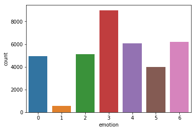
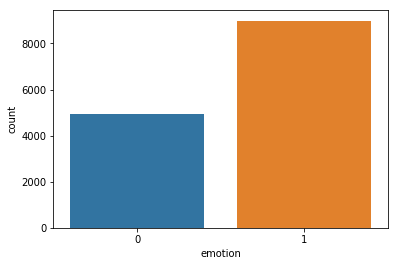
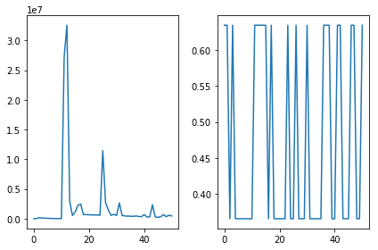
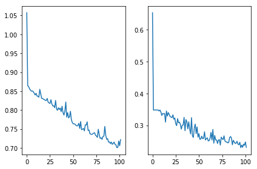
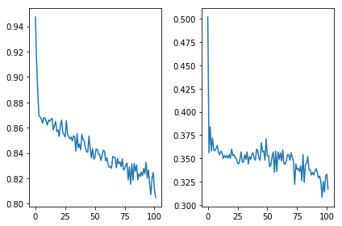

# Learning CNN hyper-params

In this project I test and improve vanilla CNN on facial expression data: https://www.kaggle.com/c/challenges-in-representation-learning-facial-expression-recognition-challenge. Here I only deal with two label classes: Happy and Angry. I utilize LazyProgrammer's (https://github.com/lazyprogrammer) vanilla CNN architecture along with Pandas and Sckit-learn to observe and improve the results. Mainly, Randomised Search for learning hyper_paramters such as learning_rate, momentum coefficient, etc and drop-out regularizer improved the default test prediction accuracy from 36% to 64%. This is a bit lower than 72% that we got from SVM trainer in https://github.com/mbastola/classical-machine-learning-in-python/tree/master/SVM/facial-expressions. However, we will continue in following projects to see if we can beat SVM modifying CNN architecutre itself.


```python
from utils import *
from classes import *
import numpy as np
import pandas as pd
import seaborn as sns
import matplotlib.pyplot as plt
import tensorflow as tf
from sklearn.grid_search import RandomizedSearchCV
from sklearn.model_selection import train_test_split
from sklearn.metrics import classification_report,confusion_matrix
%matplotlib inline
```

Load data and observe label distribution


```python
filename = "fer2013/fer2013.csv";
df = pd.read_csv(filename)
print(df.head())
sns.countplot(x='emotion',data=df)
```

       emotion                                             pixels     Usage
    0        0  70 80 82 72 58 58 60 63 54 58 60 48 89 115 121...  Training
    1        0  151 150 147 155 148 133 111 140 170 174 182 15...  Training
    2        2  231 212 156 164 174 138 161 173 182 200 106 38...  Training
    3        4  24 32 36 30 32 23 19 20 30 41 21 22 32 34 21 1...  Training
    4        6  4 0 0 0 0 0 0 0 0 0 0 0 3 15 23 28 48 50 58 84...  Training


    <matplotlib.axes._subplots.AxesSubplot at 0x7fb52f519b50>





We start out with applying CNN on two class labels:0 (Angry) and  3 (Happy)


```python
binary = True  #read labels 3 and 4 only 
balance = False
if binary:
    df = df[(df['emotion']==3) | (df['emotion']==0)]
    df['emotion'] = df['emotion'].apply(lambda x: 0 if x == 0 else 1)
X = df['pixels']
y = df['emotion']
if balance:
    X, y = balanceClasses(X,y)
sns.countplot(x=y)
```


    <matplotlib.axes._subplots.AxesSubplot at 0x7fb52bc24610>





The parseCNNInput takes (N,k) array and converts it into (N,c,sqrt(k),sqrt(k)) matrix for CNN. In this process, the pixel values are scaled to 0-1. 


```python
X,y = parseCNNInput(X,y)
```

Now we train a vanilla CNN with one 1 hidden layer and 2 pooling layers with default learning params


```python
X_train, X_test, y_train, y_test = train_test_split(X, y, test_size=0.2, random_state=42)
model = CNN(architecture_params=
    {'pool_layer_sizes':[(20,5,5),(20,5,5)],
     'hidden_layer_sizes':[500,300]
    },
    hyper_params={'lr':0.1, 'mu':0.9, 'reg':0.01, 'decay':0.99, 'eps':0.0001} 
)
```


```python
model.fit(X_train,y_train,batch_sz=30,epochs=3,debug=True)
```




```python

pred = model.predict(X_test)
err = error_rate(pred,y_test)
print("test error: " + str(err))
print(confusion_matrix(y_test, pred))
print("\n")
print(classification_report(y_test,pred))

```


    '\npred = model.predict(X_test)\nerr = error_rate(pred,y_test)\nprint("test error: " + str(err))\nprint(confusion_matrix(y_test, pred))\nprint("\n")\nprint(classification_report(y_test,pred))\n'


Lack of convergence shows that our parameter settings are not fine tuned. Lets learn the hyper paramters for this architecture. This includes learning_rate, momentum coefficient, regularizer parameter (l2), decay rate and epsilon. The way we will do this is to utilize scikit-learns Randomized Search to learn best paramters from 5D parameter space. Another way to do this would be is to use GridSearchCV which is an exhaustive search technique and would require long time to complete. 

We needed to make some modifications to the vanilla-cnn code to add get_params,set_params, score method. The estimator would fit the input data on the result (error_rate) of 1 epoch of learning which should be a good estimatore for the parameters we are seeking.

The randomized search took around 20 mins on Alienware R313. Its good to run it couple of times and take the average parameter values.  


```python
#Using Randomized Search for searching optimal learning parameters
param_grid = {'lr':[0.00001,0.0005, 0.0001, 0.005, 0.001],'mu':[0.999,0.9945,0.99,0.945,0.9],'reg':[0.00001,0.00005,0.0001,0.0005,0.001],'decay':[0.999999,0.9999945,0.99999,0.999945,0.9999],'eps':[0.0001,0.0005,0.001,0.005,0.01]}
estimator = RandomizedSearchCV(CNN(architecture_params={'pool_layer_sizes':[(20,5,5),(20,5,5)],'hidden_layer_sizes':[500,300]}),param_grid, verbose=2)
```


```python
estimator.fit(X_train,y_train)
```

    Fitting 3 folds for each of 10 candidates, totalling 30 fits
    ('\nerror_rate: ', 0.347, ', params: ', {'mu': 0.999, 'eps': 0.01, 'lr': 1e-05, 'reg': 0.0001, 'decay': 0.999945})
    [CV]  mu=0.999, decay=0.999945, lr=1e-05, reg=0.0001, eps=0.01 -  13.1s
    :
    (Debug Output removed due to large size)
    :
    ('\nerror_rate: ', 0.352, ', params: ', {'mu': 0.9945, 'eps': 0.0001, 'lr': 0.001, 'reg': 0.0001, 'decay': 0.999999})
    [CV]  mu=0.9945, decay=0.999999, lr=0.001, reg=0.0001, eps=0.0001 -  17.5s


    [Parallel(n_jobs=1)]: Done  30 out of  30 | elapsed:  7.5min finished

```python
print(estimator.best_params_)
```

    {'mu': 0.945, 'decay': 0.9999945, 'lr': 0.0005, 'reg': 0.0005, 'eps': 0.001}


Utilizing the resulting best paramters of Randomized Search:


```python
X_train, X_test, y_train, y_test = train_test_split(X, y, test_size=0.2, random_state=42)
model = CNN(architecture_params=
    {'pool_layer_sizes':[(20,5,5),(20,5,5)],
     'hidden_layer_sizes':[500,300] 
    },
    hyper_params={'mu': 0.945, 'decay': 0.9999945, 'lr': 0.0005, 'reg': 0.0005, 'eps': 0.001}
)
```


```python
model.fit(X_train,y_train,batch_sz=30, epochs=6,debug=True)
```
    ('\nerror_rate: ', 0.231, ', params: ', {'mu': 0.945, 'eps': 0.001, 'lr': 0.0005, 'reg': 0.0005, 'decay': 0.9999945})





```python
pred = model.predict(X_test)
err = error_rate(pred,y_test)
print("test error: " + str(err))
print(confusion_matrix(y_test, pred))
print("\n")
print(classification_report(y_test,pred))
```

    test error: 0.6461097167443528
    [[ 987    0]
     [1802    0]]
    
    
                 precision    recall  f1-score   support
    
              0       0.35      1.00      0.52       987
              1       0.00      0.00      0.00      1802
    
    avg / total       0.13      0.35      0.19      2789
    


    /home/mbastola/.local/lib/python2.7/site-packages/sklearn/metrics/classification.py:1135: UndefinedMetricWarning: Precision and F-score are ill-defined and being set to 0.0 in labels with no predicted samples.
      'precision', 'predicted', average, warn_for)


This CNN architecutre showed ~24% in training validation error while ~64% test error! It seems like the cnn is overfitting on the input data. One way to try better this result is to utilize dropouts. We modified the vanilla cnn to include dropouts as input and in fit function. Finally, I use p = 0.2 dropout for input layer while 0.5 drop-out for hidden layers. 


```python
X_train, X_test, y_train, y_test = train_test_split(X, y, test_size=0.2,random_state=42)
model_with_dropout_reg = CNN(architecture_params=
    {'pool_layer_sizes':[(20,5,5),(20,5,5)],
     'hidden_layer_sizes':[500,300], 
     'dropout_rates':[0.8, 0.5, 0.5]
    },
    hyper_params= {'mu': 0.945, 'decay': 0.9999945, 'lr': 0.0005, 'reg': 0.0005, 'eps': 0.001}
)
```


```python
model_with_dropout_reg.fit(X_train,y_train,batch_sz=30,epochs=6,debug=True)
```
    ('\nerror_rate: ', 0.317, ', params: ', {'mu': 0.945, 'eps': 0.001, 'lr': 0.0005, 'reg': 0.0005, 'decay': 0.9999945})





```python
pred = model_with_dropout_reg.predict(X_test)
err = error_rate(pred,y_test)
print("test error: " + str(err))
print(confusion_matrix(y_test, pred))
print("\n")
print(classification_report(y_test,pred))
```

    test error: 0.36428827536751524
    [[  71  916]
     [ 100 1702]]
    
    
                 precision    recall  f1-score   support
    
              0       0.42      0.07      0.12       987
              1       0.65      0.94      0.77      1802
    
    avg / total       0.57      0.64      0.54      2789
    


We can see that adding dropout increased the training-validation error to ~31% but significantly reduced the testing error while ~36% test error, which is train_validation_error ~ test_error and a good state to be.
