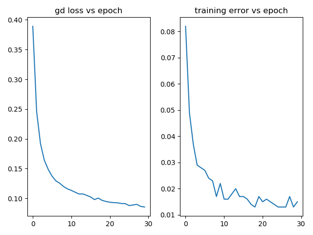
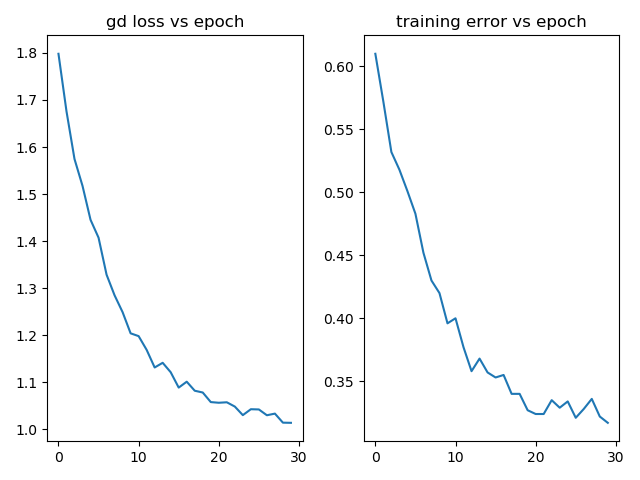

# CNN Tensorflow

In this repo, I implement CNN class using the tensorflow library. I compare the accuracies gained by the ConvPool layers to the ANN architectures of the [ANN-tensorflow](https://github.com/mbastola/neural-nets-in-python/tree/master/deep-neural-nets/ann-tensorflow) repo. We find that adding only 2 ConvPool layers before the ANN architecture does automated feature engineering and significantly increases the classification accuracies as compared to the ANN only architectures.


## MNIST:

Our tensorflow Ann with 1 hidden layer of size 30 had achieved test error of 3.4% (accuracy 96.6%) on the 10 classes handwritten digit MNIST dataset. Adding 2 ConvPool layer with convolutions params (20,5,5) & pooling of strides (1,1), followed by the ANN architecture, i.e. Fully connected layer with 1 hidden layer of 30,  achieves test error of 1% (accuracy 99% ), which is a 2.4% increment! Hence we see that a simple CNN built by adding 2 ConvPool layers to the ANN architecture is more expressive than just the ANN architecture alone for image based classification.



final training error:  0.015

test error: 0.1

Confusion Matrix:
```
[[69  0  0  0  0  0  0  0  0  0]
 [ 0 78  0  0  0  0  0  0  0  0]
 [ 0  0 63  0  0  0  0  1  0  0]
 [ 0  0  0 88  0  0  0  0  0  0]
 [ 0  0  0  0 64  0  0  0  0  0]
 [ 0  0  0  1  0 62  0  0  0  0]
 [ 0  0  0  0  0  1 66  0  0  0]
 [ 0  0  1  0  0  0  0 66  0  0]
 [ 0  0  0  0  0  0  0  0 70  0]
 [ 1  0  0  0  0  0  0  1  1 67]]
```

Classification Report:
```

              precision    recall  f1-score   support

         0.0       0.99      1.00      0.99        69
         1.0       1.00      1.00      1.00        78
         2.0       0.98      0.98      0.98        64
         3.0       0.99      1.00      0.99        88
         4.0       1.00      1.00      1.00        64
         5.0       0.98      0.98      0.98        63
         6.0       1.00      0.99      0.99        67
         7.0       0.97      0.99      0.98        67
         8.0       0.99      1.00      0.99        70
         9.0       1.00      0.96      0.98        70

    accuracy                           0.99       700
   macro avg       0.99      0.99      0.99       700
weighted avg       0.99      0.99      0.99       700
```

## CIFAR 10

For 10 class 3 channel images CIFAR dataset the ANN archecture with 3 hidden layers of sizes [128, 64,32] produced test error is 61.3% (accuracy 38.7%). For the same architecture, adding just 2 conv pool layers with convolutions params (20,5,5) & pooling of strides (1,1) reduced test error to 31.5% (accuracy 68.5%!). I've optimized my CNNs to get this down to 18% test error in my CNN advanced architecture repo. 




final training error:  0.317

test error: 0.315

Confusion Matrix:
```
[[48  2  3  2  2  1  1  0  4  2]
 [ 0 53  0  0  0  0  0  0  2 12]
 [ 2  1 29  1  9  7  2  3  2  1]
 [ 2  1  3 21  4 16  5  3  0  1]
 [ 2  0  3  2 45  1  3  2  1  0]
 [ 0  0  1  7  3 27  3  1  0  0]
 [ 2  1  4  1  2  2 51  0  1  1]
 [ 0  1  3  1 10  3  0 45  2  3]
 [ 2  7  3  1  3  3  0  0 49  1]
 [ 1  3  0  1  0  1  0  1  2 43]]
```
Classification Report:

```

              precision    recall  f1-score   support

         0.0       0.81      0.74      0.77        65
         1.0       0.77      0.79      0.78        67
         2.0       0.59      0.51      0.55        57
         3.0       0.57      0.38      0.45        56
         4.0       0.58      0.76      0.66        59
         5.0       0.44      0.64      0.52        42
         6.0       0.78      0.78      0.78        65
         7.0       0.82      0.66      0.73        68
         8.0       0.78      0.71      0.74        69
         9.0       0.67      0.83      0.74        52

    accuracy                           0.69       600
   macro avg       0.68      0.68      0.67       600
weighted avg       0.70      0.69      0.68       600
```

