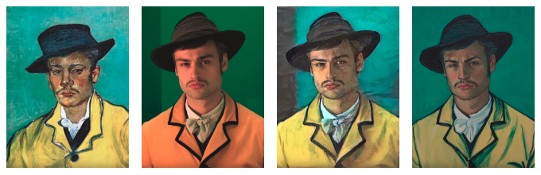
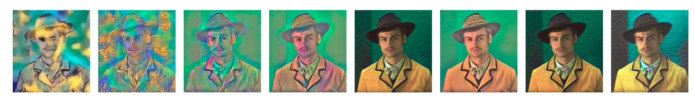
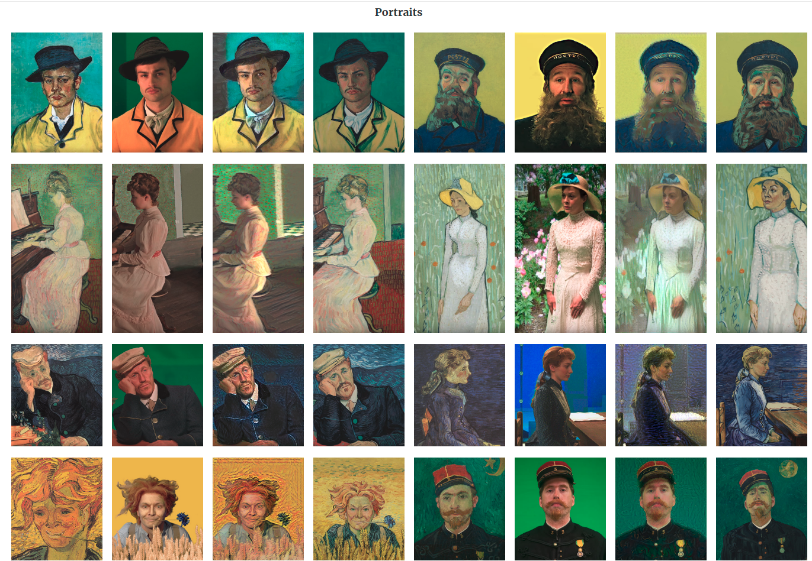
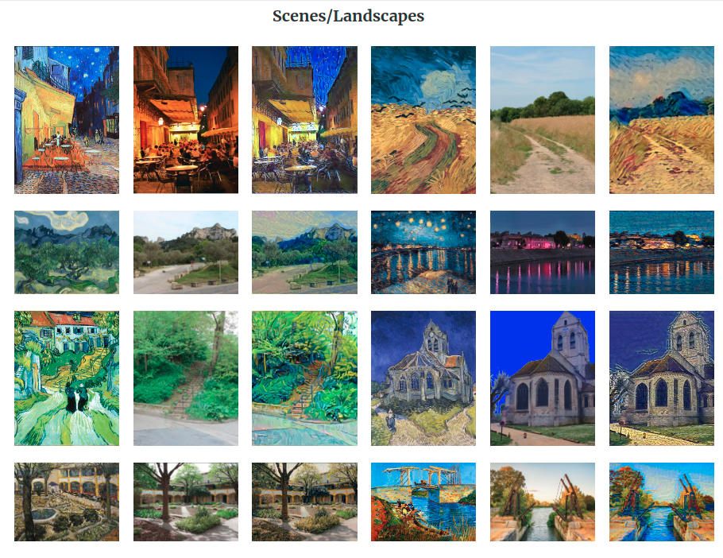

Project utilizes Transfer Learning concepts in CNN. We apply pre-trained VGG19 architecture to Van Gogh's images and compare against artist's renderings in the movie Loving Vincent. For detailed info, please visit http://blog.roodrakx.com/index.php/2019/07/14/alla-prima/

