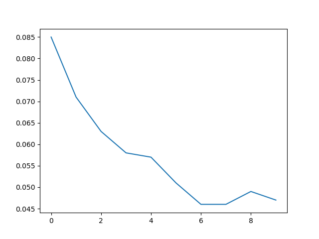
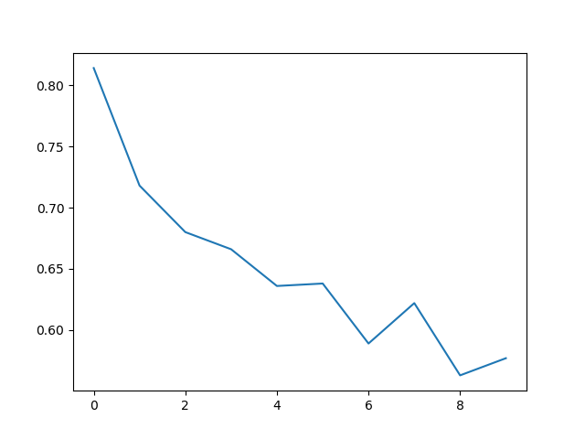

# Artifical neural network in Numpy

In this repo, I build ANNs using basic numpy tools. This was an exercise in building ANN architectures from scratch and writing Backpropagation. 

## MNIST:

Our numpy ANN with 1 hidden layer with only 30 nodes on 10 classes handwritten digit MNIST dataset achieves test error of 4.4% (accuracy 95.6% !!). 

*training_error_rate*

training error_rate:  0.03

test error: 0.04428571428571428

Confusion Matrix:

[[67  0  0  0  0  0  2  0  0  0]
 [ 0 78  0  0  0  0  0  0  0  0]
 [ 1  0 60  0  1  0  1  1  0  0]
 [ 0  1  1 81  0  2  0  2  1  0]
 [ 0  0  0  0 62  0  1  0  0  1]
 [ 0  0  0  2  0 61  0  0  0  0]
 [ 1  0  1  0  0  0 65  0  0  0]
 [ 0  1  0  0  0  0  0 65  0  1]
 [ 1  0  1  1  1  0  1  0 65  0]
 [ 1  0  0  0  1  0  0  2  1 65]]

Classification Report:

                 precision    recall  f1-score   support

         0.0       0.94      0.97      0.96        69
         1.0       0.97      1.00      0.99        78
         2.0       0.95      0.94      0.94        64
         3.0       0.96      0.92      0.94        88
         4.0       0.95      0.97      0.96        64
         5.0       0.97      0.97      0.97        63
         6.0       0.93      0.97      0.95        67
         7.0       0.93      0.97      0.95        67
         8.0       0.97      0.93      0.95        70
         9.0       0.97      0.93      0.95        70

    accuracy                           0.96       700
   macro avg       0.96      0.96      0.96       700
weighted avg       0.96      0.96      0.96       700
               

## CIFAR 10

For 10 class 3 channel images CIFAR dataset we try deeper archecture with 3 hidden layers of sizes 128, 64 and 32 nodes. The result is 53% which is not bad for a difficult image dataset. I've used CNNs to get down to 18% test error in my CNN folders. 

*training_error_rate*

training error_rate: 0.577

test error: 0.5316666666666666

Confusion Matrix:

[[33  2  1  4  0  3  3  7 10  2]
 [ 0 38  0  3  0  0  3  2  6 15]
 [ 5  1  7  7  2  3 14 17  0  1]
 [ 1  0  2 30  0 11  6  3  1  2]
 [ 7  0  7  7 10  5 14  6  3  0]
 [ 0  0  2 17  0  7  7  8  0  1]
 [ 0  1  3  5  2  0 44  8  0  2]
 [ 3  1  1  4  6  3  3 43  0  4]
 [ 6  1  1  5  0  1  1  6 36 12]
 [ 0  4  0  2  1  1  2  4  5 33]]

Classification Report:

              precision    recall  f1-score   support

         0.0       0.60      0.51      0.55        65
         1.0       0.79      0.57      0.66        67
         2.0       0.29      0.12      0.17        57
         3.0       0.36      0.54      0.43        56
         4.0       0.48      0.17      0.25        59
         5.0       0.21      0.17      0.18        42
         6.0       0.45      0.68      0.54        65
         7.0       0.41      0.63      0.50        68
         8.0       0.59      0.52      0.55        69
         9.0       0.46      0.63      0.53        52

    accuracy                           0.47       600
   macro avg       0.46      0.45      0.44       600
weighted avg       0.48      0.47      0.45       600

