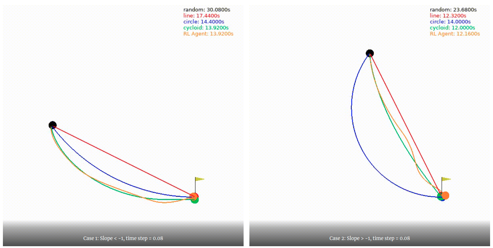
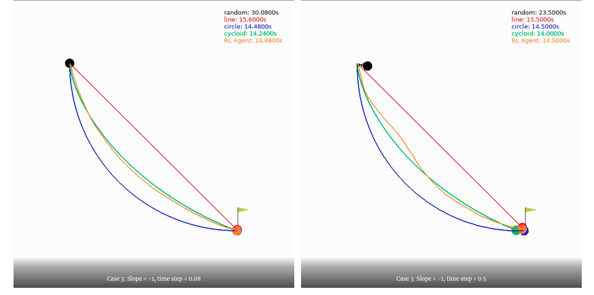
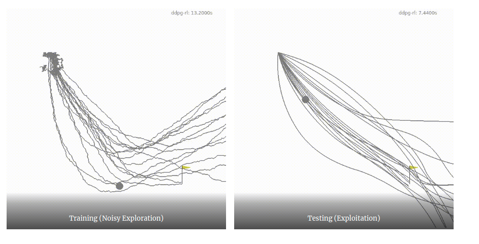
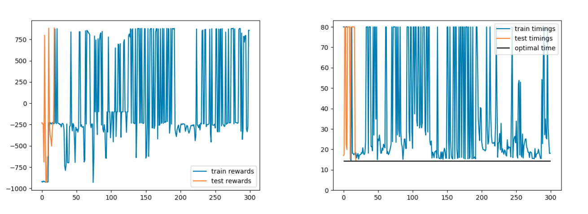

Project utilizing DDPG algrithm for continuous action spaces in Reinforcement Learning (RL). Here I reformulate age old Brachistochrone problem and tackle it with RL. More info at http://blog.roodrakx.com/index.php/2019/09/06/brachistochrone/

